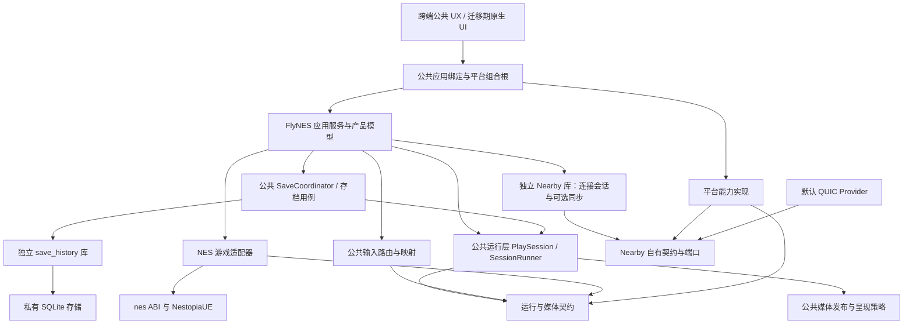
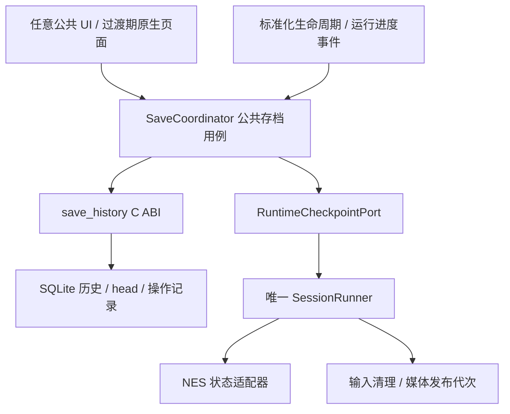

# FlyNES 分层架构梳理与重构方案

> 最新决策：用户已选定 Flutter。完整模块划分、存档接续及 45 项落地需求统一见 [Flutter 三端统一架构与重构落地路线](roadmap.md)。本文保留早期审阅和讨论记录，涉及“选型未定”的表述已被该总方案取代。

日期：2026-09-28。审阅基线：`main@78057350c12b`，产品版本 `2.0.0`。

状态：供评审的架构方案，未实施。本文只新增设计文档，不修改产品代码、构建配置、版本或现有设计入口，也不创建分支、提交或发布。

用户确认的目标：附近联机抽成通用联机会话库，优先服务 FlyNES，保留其他游戏或模拟器接入能力；公共能力下沉，三端适配尽量薄；多人输入与输出分离，未来手柄复用同一接口。

同日补充：结合任务 [评估 Flutter UX 迁移](codex://threads/01a0e860-0aee-7eb2-973d-16ef06ef6c3c)，补充了公共 UX 迁移路线。后续横向调研撤回提前优先选择 Flutter 的建议：框架尚未定案，最新结论见 [跨端技术选型与公共手柄组件调研](technology-research.md)。第 12 节保留 Flutter 候选的接入方案和初始估算，不代表最终选型。

存档范围补充：任务 [修复通关后重新开始](codex://threads/01a0e85e-d42a-7360-b2d4-06e07971f3e5) 正在独立 worktree 实现存档历史库，已纳入本次整体架构。以其独立库为复用基础，将公共存档编排、运行快照端口及跨端迁移纳入本文；具体边界与衔接见第 13 节。该任务的实施授权不改变本任务仅输出方案的范围。

## 1. 架构结论与方案选择

建议以现有可玩链路为基础，形成“公共 UX → 公共应用服务 → 游戏运行与输入输出 → 游戏适配器 → NES 核心”的主干，并将附近联机做成旁路组合的独立库。公共 UX 的承载技术通过应用框架和游戏引擎的横向评估确定，迁移期间兼容现有原生 UI；媒体后端是否迁入引擎单独验证，系统能力保留薄适配。通用联机库通过传输端口和模拟端口工作，不依赖 FlyNES 产品、ROM 目录、NES 位掩码或音视频格式。

当前问题并非缺少共享代码，而是共享代码的职责边界和实际调用边界不一致：单机/联机执行入口分叉，通用会话与 NES 运行时耦合，平台桥接中仍承载生命周期、内容匹配及输出调度规则。只移动目录或增加一层转发接口不能解决这些问题。

| 方案 | 收益 | 代价与局限 | 建议 |
| --- | --- | --- | --- |
| 独立库＋端口隔离＋逐条链路迁移 | 能独立构建和测试；保留当前行为；持续减少平台业务逻辑 | 迁移期间需要有期限的兼容门面 | 采用 |
| 只把 `lan_mvp` 移到新目录 | 改动小，容易开始 | 仍依赖 `fly_runtime`、ROM、RGB565；无法供其他游戏直接接入 | 仅可作为机械迁移步骤 |
| 全量替换为新的通用引擎，或直接切回历史完整会话架构 | 表面上结构统一 | 同时改变调度、协议、产品流程，难定位回归；历史实现不等于当前可玩实现 | 不采用 |

“通用”分两层：任何游戏可以复用连接、邀请、成员和消息会话；只有满足确定性步进、快照恢复和输入编码契约的游戏，才能复用帧同步/回滚模块。不能把 NES 的同步模式宣称为任意游戏的通用联网方案。

## 2. 当前架构与主要耦合点

### 2.1 实际调用链

```text
Android 单机：MainActivity → EmulationSession/NesCore → JNI → nes_* → NestopiaUE
iOS 单机：RunSurfaceViewController → RuntimeBridge → fly_runtime_* → nes_*
Harmony 单机：NativePlayRuntime/PlaySession → fly_runtime_* → nes_*

三端当前联机：平台 Owner/Bridge/N-API → fly_lan_mvp_*
             → LAN 会话（QUIC、协议、输入预测/回滚、ROM、画面、PCM）
             → fly_runtime_* → nes_* → NestopiaUE

公共产品：fly_app / flynes_product → 游戏目录、设置、控制布局、产品投影等
另有历史完整会话：fly_session v1/v2、engine/link/dual/content/recovery 等
```

以上是静态源码与构建依赖核对结果，不是本次重新运行三端后的认证结论。三端已有渲染器和音频设备复用，问题主要在数据源、控制入口及编排规则仍分叉。

### 2.2 保留的基础

- `core/` 已有独立的 `nes_*` C ABI，NestopiaUE 被封装在底层，方向正确。
- `fly_runtime_*` 已有逐帧输入、时间线、快照、摘要、PCM 和完整帧接口，可作为迁移基础，无须重写模拟内核。
- `fly_app` 已统一部分目录、设置及持久化；`content/` 的内容单一来源继续保留。
- 已有 QUIC Rust provider 及 C ABI，可作为独立联机库的默认传输后端。
- 当前可玩联机已有单工作线程推进、预测上限、回滚槽、最终画面发布和防止音频重复交付等行为，抽取时应先原样保持。
- Android `InputRouter` 已区分触屏、键盘、手柄和无障碍，并将应用操作与游戏按键分开，值得提炼为公共输入模型。

### 2.3 需要重划的边界

| 发现 | 源码证据 | 影响与处理 |
| --- | --- | --- |
| 联机公共头直接依赖游戏运行时 | [flynes_nearby_mvp.h](../../shared/include/flynes/flynes_nearby_mvp.h) 包含 `flynes_runtime.h`，提供 `select_rom`、RGB565 和 PCM 接口 | 新联机公共 API 只保留会话/同步契约；ROM 与媒体接口归游戏适配和运行层 |
| 当前联机会话同时承担网络、游戏、媒体 | [lan_mvp/session.cpp](../../shared/src/session/lan_mvp/session.cpp) 中会话持有 `fly_runtime_t*`、QUIC provider、输入历史和 PCM 队列；`select_game` 创建并加载 runtime | 拆为连接会话、确定性同步驱动、FlyNES 游戏适配、媒体发布器 |
| 主客角色和玩家端口绑定 | 联机头定义 `HOST_P1/GUEST_P2`，`session.cpp` 按角色直接填 `buttons[0/1]` | 通用库分开 `PeerId`、房主权限和 `SeatId`；当前产品仍保持房主 P1、客机 P2 |
| Android 单机绕过公共 runtime | [nes_jni.cpp](../../app/src/main/cpp/nes_jni.cpp)、[MainActivity.java](../../app/src/main/java/com/flynes/emu/MainActivity.java) | 单机和联机最终都经统一 PlaySession；迁移前核对现有存档、音频与显示能力，不能直接机械替换 |
| 输入抽象局限于平台和按键类型 | [InputRouter.java](../../app/src/main/java/com/flynes/emu/input/InputRouter.java) 按 `Source` 类别合并并裁剪为 8 位；[FrameInputLatch.hpp](../../ios/app/run/FrameInputLatch.hpp) 单独实现短按保持 | 无法自然区分两只同类手柄；抽出设备实例、座位映射、采样与归一化，保持现有短按语义 |
| 联机输入丢失部分来源信息 | Android `MainActivity` 联机路由收到 `(bits, time)` 后仅传 `bits`，由 [NearbyMvpPlayController.java](../../app/src/main/java/com/flynes/emu/NearbyMvpPlayController.java) 定时提交 | 统一输入入口保留本机采集时间与序号，时间戳只作本机诊断，不参与跨机时间比较 |
| 平台桥接包含产品编排 | [FlyNesNearbyBridge.mm](../../ios/app/bridge/FlyNesNearbyBridge.mm) 处理内容标识、选择重试和代次；[napi_init.cpp](../../harmony/entry/src/main/cpp/napi_init.cpp) 管理联机会话、输入及媒体接线 | 将可复用规则移到应用服务和运行层；桥接只负责类型、资源与线程边界转换 |
| 底层公共类型倒挂到应用头 | [flynes_runtime.h](../../shared/include/flynes/flynes_runtime.h) 包含 `flynes_app.h` 使用 `fly_result` | 公共错误、缓冲区及版本约定移入小型基础契约，runtime 不再包含目录/设置 API |
| 构建边界泄露实现细节 | [shared/CMakeLists.txt](../../shared/CMakeLists.txt) 中 `flynes_lan_mvp` 公开链接 runtime 和 session codec；多个目标公开 `src/session`；Android 直接包含其内部目录 | 每模块独立 target 和 public include，禁止平台引用共享内部目录 |
| 部分通用策略仍在平台目录 | Harmony [display_policy.hpp](../../harmony/entry/src/main/cpp/display_policy.hpp)、iOS [PlaybackClock.hpp](../../ios/app/audio/PlaybackClock.hpp) 与 [CoverCapturePolicy.hpp](../../ios/app/platform/CoverCapturePolicy.hpp) | 先核对行为差异，再提取策略；实际设备调用继续留平台 |
| 历史模型与当前产品并存 | [session/README.md](../../shared/src/session/README.md) 仍称 `lan_mvp` 待实现；[nearby_ui_state.hpp](../../shared/include/flynes/product/nearby_ui_state.hpp) 保留历史配对码、好友等模型 | 标明当前生产依赖、兼容、实验/历史三类；按调用图清理，不把旧完整架构重新当目标 |

文档现状以 [docs/nearby/README.md](../nearby/README.md) 及其最新证据入口为准。旧文档中的固定主客平台、尚未接线等描述不能覆盖当前源码和后续记录。看到历史类型或文件被编译，也不能直接推断其功能仍在当前 UI 中启用。

## 3. 目标分层与依赖规则

下图箭头表示源码依赖；平台能力由上层组合根注入，公共层不反向依赖平台实现。



具体运行时由应用组合根把 Nearby 同步驱动、NES 模拟端口实现和 PlaySession 装配起来。图中未画跨接口调用的运行时反向箭头，避免把依赖倒置误读成源码循环依赖。

| 模块 | 拥有的职责 | 明确不拥有的职责 |
| --- | --- | --- |
| 基础契约 | 错误/状态、字节缓冲、所有权、版本约定、本机单调时钟接口 | 全能工具类、全局服务定位器、产品对象 |
| NES core / `nes_abi` | NES 执行、CPU/PPU/APU、mapper、机器状态 | 房间、网络、页面、输入设备枚举 |
| NES 游戏适配器 | 内容加载、NES 输入编码、核心步进、状态/摘要、媒体格式转换 | 配对、平台权限、UI 导航 |
| 公共运行层 | PlaySession 生命周期、唯一执行器、驱动切换、游戏输出发布、安全停帧/捕获/恢复端口 | 存档数据库、保留策略、原始 socket、系统音频 API、页面控件 |
| 公共输入 | 设备状态、映射、来源合并、座位绑定、帧采样、清理规则 | 网络连接、游戏画面、具体 OS 事件对象 |
| 公共媒体/呈现 | 帧元数据、缓冲所有权、音频游标、回滚输出协调、呈现决策 | Metal/OpenGL/OHAudio 的对象和调用 |
| 独立 Nearby | 邀请、连接、成员、消息、可选帧同步/回滚、协议兼容 | ROM/目录、NES、封面、RGB565、PCM、游戏名称规则 |
| 独立 save_history | 不透明状态/截图、历史与继续位置、保护/淘汰、完整性校验、恢复操作持久化 | 核心捕获/恢复、游玩时钟、ROM 解析、Nearby、UI、平台 SDK |
| 公共 SaveCoordinator | 自动保存策略、内容/格式映射、保护后恢复/重开编排、迁移与错误投影 | SQL、模拟器第二执行线程、三端页面逻辑 |
| FlyNES 应用/产品 | 内容目录、设置、选游戏、自动准备、房间流程、存档/封面策略、可用能力投影 | 游戏逐帧推进、网络编解码、设备 API |
| 平台适配 | 文件授权、网络绑定、热点、相机、物理输入、音频设备、GPU/显示、系统生命周期、持久凭据 | 三份内容匹配策略、三份会话状态机、三份回滚算法 |

层次清晰并不要求每层一个动态库。优先用明确的 CMake target 和 include 可见性建立边界，移动端仍可静态链接。独立仓库、插件动态加载和更多编程语言均不是本次重构前提。

## 4. 独立 Nearby 库

### 4.1 包结构与独立性

建议先放在仓库内 `libs/nearby/`，可单独配置、构建、测试和安装导出；具备独立包边界后，再决定是否迁到外部仓库。

```text
libs/nearby/
  include/nearby/        # 自足的 C ABI、版本化 DTO、端口契约
  src/session/          # 邀请、连接、成员、会话代次、控制消息
  src/protocol/         # 有界编码、解码、兼容协商
  src/sync/             # 可选的确定性输入同步、预测、回滚调度
  providers/quic/       # 现有 Rust provider 的后续归属
  tests/                # 不依赖 FlyNES 的协议和同步测试
  examples/             # 微型确定性状态机接入示例
  CMakeLists.txt
```

对消费者提供一个 Nearby 包，内部拆为 `nearby_session`、可选 `nearby_sync`、默认 `nearby_transport_quic`。不把它拆成多个需要独立发布和协调版本的产品。

独立性的验收方式：仅取 Nearby 包及其已声明第三方依赖，不能访问 `core/`、`shared/`、`app/`、`harmony/`、`ios/`、ROM 或内容清单，也能完成构建、会话测试和非 NES 示例运行。Nearby 公共头不得传递包含 `flynes_*` 或 `nes_*` 头文件。

### 4.2 连接会话和游戏局分离

- `ConnectionSession`：邀请、连接、对端身份/认证材料、成员、端点、断开原因。跨换游戏保留。
- `Round`：一次游戏运行配置和输入时间线。内容或配置变化产生新 `round_id`，旧局消息拒绝进入新局。
- `SessionRole`：房主/加入者及控制权限。
- `SeatAssignment`：玩家座位与所有者的映射，独立于角色和设备。

当前 FlyNES 产品仍是两端、房主 P1、客机 P2；只是将限制移到应用策略，不以本次抽象之名新增四人联机、任意抢座或主机迁移。库显式报告容量，不支持的容量返回原因。

开局时交换版本化的 `GameDescriptor`：应用命名空间、内容指纹、游戏适配器/确定性执行兼容标识、输入 schema、规则配置指纹、时间步长及支持的同步方式。联机库验证描述及一致性，不解析 ROM。内容查找和授权由 FlyNES 完成；目录标题、文件路径和本机 canonical ID 不作为跨端内容相等的最终依据。

迁移初期保留当前 ROM 哈希与配置哈希算法及现有 wire 格式，通过兼容适配器转换。新的结构化协商属于显式协议升级，不能在机械抽取阶段偷偷改变已有哈希含义。

### 4.3 契约与调用方向

以下是职责级接口草案，不是本次新增的代码或已冻结 ABI。

| 契约 | 主要动作/数据 | 实现者与调用者 |
| --- | --- | --- |
| `NearbySession` | host、join、leave、会话快照、成员事件、受控消息通道 | 库实现；应用服务调用 |
| `TransportPort` | listen/connect、发送、接收完成事件、取消、关闭；有界队列和明确顺序语义 | QUIC provider 实现；库调用 |
| `NetworkBinding` | 已就绪端点、网络租约/绑定标识、失效事件 | 平台提供；连接层使用，不要求互联网探测成功 |
| `SimulationPort` | `step(frame, inputs, execution_mode)`、捕获/恢复不透明状态、确定性摘要、能力描述 | 游戏适配器实现；可选 sync 模块调用 |
| `InputSchema` | schema ID/版本、载荷上限、确定性编码与校验、预测规则 | 游戏适配提供；sync 按契约校验和存储 |
| `SyncEvents` | 回滚开始、修正完成、确认水位、暂停、错误、摘要不一致 | sync 产生；运行层消费，不携带 RGB565/PCM |
| `Clock/Random/Diagnostics` | 单调时间、随机材料、脱敏结构化事件 | 标准实现或平台注入；可被测试替身替换 |

`SimulationPort` 的实现可在 FlyNES 内把执行结果交给公共媒体发布器。Nearby 只观察同步相关的状态和步骤结果，不获取显示设备，也不成为 PCM 消费者。

不同游戏可以仅使用连接会话及消息接口。选择确定性同步的游戏必须满足快照可恢复、相同配置与输入产生相同状态、回滚重演不执行不可撤销外部副作用。载荷虽然对连接层不透明，但有命名空间、schema、长度上限和校验，不能退化为无约束的任意 JSON 总线。

### 4.4 网络选择、安全与范围

LAN 优先、无 LAN 时尝试热点的策略归 FlyNES 应用服务；查询网卡、绑定系统网络、获取/释放热点 reservation、打开设置页归平台。平台返回能力和失败原因，公共层决定下一步及 UI 状态。扫描器只提供 QR 文本，邀请解析和有效性判断由共享实现负责。

保留现有邀请中的凭据绑定、证书 pin、令牌、有效期和连接取消语义；不把它们简化成“IP＋端口”。协议解析有大小上限、状态约束和会话/局代次隔离。版本不兼容必须拒绝，不能降级成不安全连接。诊断不记录二维码凭据、网络密码或 ROM 内容。

继续只保留一条 QR 配对路径。好友、蓝牙发现和配对码不作为新库默认能力；STREAM、ROM 传输、自动恢复继续后置。物理手柄即使使用蓝牙连接，也只是 OS 输入设备，不属于附近联机发现功能。

## 5. 统一输入与输出：为触屏和手柄建立同一通路

### 5.1 输入链路

```text
触屏 / 键盘 / 手柄 / 无障碍
  → 平台 InputDeviceAdapter
  → InputHub：设备实例、来源状态、映射、短按保持、方向归一化
  → SeatRouter：设备 → 本地玩家 → 游戏座位
  → InputSampler：采样成版本化的每帧输入
  → 单机 LocalDriver 或联机 NearbySyncDriver
  → 按座位排列的 FrameInputBatch
  → NES 适配器 → nes_* 输入

远端输入 → Nearby 协议校验与所有权检查 → 同步驱动的输入历史
         → FrameInputBatch
```

远端输入不伪装成本机 `GAMEPAD` 来源重新走触屏合并器，否则会再次采样、改写帧号或错误合并座位。游戏只看规范化的玩家输入，不知道它来自屏幕、物理手柄还是远端。

### 5.2 四个稳定的数据边界

| 数据 | 建议携带 | 不应混入 |
| --- | --- | --- |
| `DeviceInputEvent` | device/source 实例 ID、generation、control ID、值、事件序号、本机采集时间 | 网络包、ROM ID、UI 控件对象 |
| `PlayerInputState` | player/seat、数字键状态、量化轴状态、映射配置版本 | 系统 keycode、平台对象 |
| `FrameInput` | session/round/epoch、frame、seat revision、seat、sequence、schema ID、规范化载荷 | 跨设备比较的本地时间、文件路径 |
| `AppCommand` | 暂停菜单、回房间、设置、断开等显式应用意图 | NES Start/Select 等游戏按键 |

NES schema 可继续使用 8 位按钮；其他游戏的输入格式由其适配器声明。手柄轴到方向键的死区、迟滞和冲突规则在公共映射层确定，wire 中只发送规范化结果，避免两端再按不同平台规则解释。

### 5.3 必须明确的输入语义

1. **区分设备实例。** 来源类型不能代替 `device_id`。两只手柄是两个实例，可绑定不同座位；单一手柄拔出不清空另一只手柄或触屏。
2. **分离网络角色与座位。** 房主是控制权限；P1/P2 是当前游戏座位；手柄是物理设备。映射由产品选择，库校验谁有权提交哪个座位。
3. **同座位多来源合并。** 普通按钮合并须保留来源所有权；一个来源松开不能释放另一来源仍按住的按钮。方向冲突使用明确、可测试的配置，迁移先保留各现有路径语义，再统一。
4. **短按由实际采样确认。** 输入更新与“被某帧消费”分开；显示刷新或重复画面读取不能清除待采样短按。取消、失焦、设备断开立即清理对应来源，不套用正常抬手的保持时间。
5. **采集和采样分开。** OS 事件及时入队；唯一模拟执行器在帧边界采样。渲染帧率、音频回调频率不决定按键提交次数。
6. **本地时间只做诊断。** 同进程统一单调时间域；网络同步使用帧号、序号、局代次，不拿两台设备的时间戳相减。
7. **初次保持两人能力。** 接口不硬编码主机等于输入端口 0，但当前支持上限仍明确为两人；未来多手柄/多玩家需单独实现和验收。

未来接入手柄时，新增 OS 设备采集适配、映射配置及绑定 UI 即可复用 InputHub、SeatRouter、FrameInput 和单机/联机驱动，无须改写网络协议或另建播放流程。是否支持某种新控制类型仍需双方协商相同输入 schema。

### 5.4 输出接口独立于输入和联网

```text
GameRuntime 执行结果
  → OutputPublisher（帧号、epoch、generation、缓冲所有权）
       → VideoFrameSource → 三端 GPU Presenter
       → AudioSource      → 三端 AudioSink
       → FrameObserver    → 公共封面/截图策略 → 平台编码与存储
       → FeedbackEvent    → 座位/设备映射 → 可选手柄震动适配
```

- `VideoFrame` 描述尺寸、stride、像素格式、源帧号、发布序号、代次及持有期限，不把 256×240/RGB565 写进通用接口。NES 适配器首期仍发布现有格式。
- `AudioBlock` 描述采样格式、声道、采样率、样本区间和时间线；只有一个主播放消费者推进消费游标。录制/观察需要显式复制或独立订阅，不能从主 PCM 队列抢数据。
- 视频允许跳过旧发布并读取最新帧；音频是连续、有界的数据流，溢出、欠载、暂停、设备重建各有明确策略，不与视频共用一个“最新数据”接口。
- 手柄输出使用独立 `FeedbackSink`，按 seat 映射到当前设备。先定义扩展边界，不要求 NES 产生不存在的震动效果。
- `readLatestFrame`、`readAudio` 和 `snapshot` 只观察数据；均不得推进游戏、网络或输入采样。慢 UI 和慢截图消费者不能反压模拟执行。

### 5.5 保留回滚输出的正确行为

输入确认水位、模拟帧号、媒体发布序号必须分开。预测帧可用于低延迟展示；发生回滚时只发布最终修正画面，中间重演帧不作为新画面逐帧展示。

音频采用当前基线的行为：撤销并替换尚未交付的样本区间，已交给设备的音频不能撤回，也不能在重演后重复播放。抽取时不擅自改为“等待全部确认再播放”，避免引入新的音频延迟。

保存、封面、通知和未来震动等副作用不能在重演中重复执行。媒体可有受控的推测性输出；持久化/反馈由运行层按确认和去重策略处理。每个输出携带 round/epoch/generation，消费者拒绝旧局输出。

## 6. 底层运行与线程模型

### 6.1 单机与联机共用 PlaySession

公共 `PlaySession` 对上提供统一的开始/暂停/继续/结束、输入提交、状态、视频源和音频源。内部选用 `LocalDriver` 或 `NearbySyncDriver`，页面和媒体设备不再各自判断用哪组底层函数。

能力差异通过 `SessionCapabilities` 表达，例如当前是否允许本机读档、换游戏和调整某项运行参数。单机和联机可以有不同能力，但复用调用形状，不能为追求接口一致而允许联机一端随意读档导致失步。

NES 适配器逐步吸收现有 `fly_runtime` 的 NES 包装部分；通用运行层吸收时间线、输入采样和输出管理部分。`core/` 中与呈现有关的纯算法可后续归入媒体模块，NestopiaUE、机器状态和源帧时序继续留在核心侧。

### 6.2 唯一执行权

- 每个活跃 PlaySession 由一个串行 `SessionRunner` 拥有模拟执行权；只有它能通过所选驱动调用 step/load/restore。
- Nearby 的连接 I/O 可保留独立线程；网络完成回调只入队，不在 provider 回调栈内执行核心、更新 UI 或销毁会话。
- 确定性同步模块在 SessionRunner 的串行上下文中消费网络事件、确定输入并调用 SimulationPort。它不再另启第二个模拟定时器。
- 平台显示回调读取最新帧；音频回调读取已发布样本，不在实时音频回调中等待网络、磁盘、核心互斥锁或线程退出。
- 应用命令通过有界队列提交，结果通过带序号的事件/快照发布。对外观察回调在内部锁外发送，避免重入死锁。

这是目标模型。第一次拆分 `lan_mvp` 时先保留现有 worker 行为，再把执行器移交给公共运行层；同一会话的旧、新驱动不得同时启用。

### 6.3 所有权与销毁

应用级会话拥有者持有连接、网络租约和 PlaySession；页面仅持有观察订阅或可撤销的会话引用。回房间和页面消失不直接销毁连接；明确离开或连接终止才释放。

结束顺序为：拒绝新命令和增加 generation → 停止输入来源/解绑座位 → 停止驱动并撤销未完成操作 → 让网络回调和媒体消费者退场 → 销毁 runtime → 关闭连接并释放网络租约。实现时禁止持锁 join、回调访问已释放 context，以及旧页面暂停新一局。

暂停保留当前双方请求与明确“继续游戏”确认语义；回房间保留运行状态；换游戏创建新 round，但保留 connection。状态机分别表达连接、游戏运行和本机页面，不把三者压进一个大枚举。

### 6.4 ABI 与数据契约

对三端继续使用小型稳定 C ABI；内部使用 C++ 类型。跨边界使用不透明句柄、定宽整数、显式长度、`struct_size/version`、明确的借用/复制/释放约定，不暴露 STL、平台对象或 C++ 异常。

将 `fly_result` 等基础类型从应用大头文件中拆出，迁移期保留旧头的兼容包含。不要就地改变旧结构体布局或错误码。通用 Nearby 自有 ABI 不依赖 FlyNES 的基础库，以免抽取后仍间接依赖产品。

分别管理产品发布版本、各库 C ABI 版本、网络协议版本、游戏确定性配置/状态格式版本，以及存档数据库 schema 版本。数据库升级不代表核心快照兼容，UI 框架升级也不能改变存档身份域。`VERSION` 继续是产品语义版本单一来源，本方案不提出大版本变更。

## 7. 三端适配如何变薄

“薄”以业务规则数量衡量，而不是以代码行数衡量。音频设备恢复和 GPU 资源生命周期本来就需要平台代码，应保留清晰、可测的实现。

| 平台当前区域 | 下沉后的公共职责 | 平台保留 |
| --- | --- | --- |
| Android `MainActivity`、`EmulationSession`、`NearbyMvpPlayController` | 会话生命周期、输入采样、媒体源、暂停/换局规则 | Activity 生命周期映射、AudioTrack、EGL/Swappy、输入事件、系统权限与热点 |
| Harmony `napi_init`、`NativePlayRuntime`、`PlaySession` | 产品命令编排、游戏步进、联机输出源、通用显示策略 | N-API 编解码、XComponent、OHAudio、显示/温控事实、网络系统调用 |
| iOS `RunSurfaceViewController`、`FlyNesNearbyBridge` | 运行时钟策略、内容匹配、重试代次、短按采样、暂停与会话归属规则 | ObjC++/Swift 绑定、UIKit、Metal、AVAudio、相机和系统授权 |
| 三端内容导入/设置/封面 | 内容身份、索引/设置语义、封面触发和评分规则 | 安全文件访问、系统目录选择、资源读取、图片编码/落盘 |
| 三端存档 Adapter / Service | 运行时间与触发策略、保护/回退/重开状态机、继续位置、旧档迁移编排 | 沙箱路径、旧平台格式读取、生命周期事件、必要截图编码及现有执行器接线 |

继续使用公共目录与设置作为权威状态。Android 现有 `DualSettingsStore` 的 native snapshot 已是权威，SharedPreferences 是镜像；不把它误判成两个需要强行合并的业务源。平台 DTO 可以存在，但只做投影，不能自行推导一套开局、兼容性或能力开放规则。

硬件事实由平台报告，公共策略输出请求、资格与降级原因。三端不必支持相同的 GPU 特性，也不能因为接口统一而开启没有设备证据的 Extreme 或高刷新能力。

## 8. 建议目录与旧代码归属

```text
core/                       # 保留 NES ABI 和 NestopiaUE
libs/
  nearby/                   # 可独立消费的联机会话包
  save_history/             # 复用关联任务的独立历史库；SQLite 私有依赖
shared/
  foundation/               # FlyNES 基础契约，不依赖 app
  input/                    # InputHub、映射、采样、seat 路由
  runtime/                  # PlaySession、唯一执行器、LocalDriver
  media/                    # 输出发布、时间线、呈现与封面公共算法
  game/nes/                 # NES 游戏适配、内容/状态/输入 schema
  application/              # 目录、设置、房间、启动/保存/封面用例
    save/                   # SaveCoordinator、运行计时、迁移和恢复编排
  product/                  # UI 无关的产品状态与能力投影
  bindings/                 # 公共 ABI 门面；三端语言桥仍放各端
app/、harmony/、ios/         # 原生 UI、系统能力适配、语言绑定、组合根
content/                    # 保持现有单一内容来源
```

这是职责归属建议，不要求一次重命名整个 `shared/`。先分 target 和头文件，再分离实现，最后移动路径；避免把大量纯移动 diff 和行为变化混在一次迁移里。

| 现有实现 | 目标归属/处理 |
| --- | --- |
| `lan_mvp/invite.*`、`wire.*`、连接状态与消息处理 | Nearby session/protocol；保留当前 wire 行为 |
| `session.cpp` 的输入历史、预测、确认、回滚调度 | Nearby sync；通过 SimulationPort 执行 |
| `session.cpp` 的 ROM 加载、config hash 中 NES 语义 | NES 适配器与 FlyNES 开局服务 |
| `session.cpp` 的帧/PCM 缓冲与重演输出协调 | 公共 runtime/media |
| `nearby-quic-provider` | Nearby 默认 provider；保留 Rust 与第三方版本锁定 |
| `fly_runtime` | 先作为兼容实现，再分出 NES 适配和公共运行机制 |
| `ProductDualRuntimePort` 及旧 dual 契约 | 作为端口设计参考和可复用代码候选；当前仍含 FlyNES/四端口耦合，不直接当通用 API |
| `fly_session v1/v2`、历史 link/content/recovery | 先核对生产引用和复用点；必要兼容隔离，未启用能力不成为新库强依赖 |
| 三端房间/网络流程 | 规则归应用服务，系统 effect 归平台；选型验证后逐步迁入公共 UX |
| 关联任务 `libs/save_history` | 独立保留并复用；不迁入 runtime，不与 Nearby 合库，不重复建设持久化后端 |
| 存档 policy 与三端 SaveHistory Adapter / Service | 纯规则/用例归 application/save；平台执行器和旧档读取保留薄端口；以关联任务最终产物核对迁移清单 |

删除历史模块之前必须证明生产无引用、构建无隐式依赖，并迁移仍有价值的测试。不要仅因文件名包含 Friends、V2 或旧日期就整目录删除。

## 9. 分阶段重构顺序

以下是未来实施的工作包及验收边界。本次只交付方案，没有执行其中任何代码步骤。

| 阶段 | 工作内容 | 完成判据 | 风险控制 |
| --- | --- | --- | --- |
| 0：固定基线与契约 | 标注当前可玩入口、模块依赖、线程/资源所有者、历史路径；冻结受影响场景和记录格式；登记存档任务最终 revision/ABI/schema/验收范围 | 单机/联机链路与对应测试可追踪；协议/ABI/存档兼容清单齐全 | 关联任务进行中不视作 main 已具备；记录已有未签收项 |
| 1：建立模块隔离 | 提取小型基础类型；引入 Nearby 独立 target/public headers；旧 ABI 继续作兼容门面 | Nearby session 不包含 FlyNES/NES 头；消费者不引用 `src/session`；旧流程保持 | 仅搬迁和转接，wire 与同步参数不变 |
| 2：拆开游戏与联机 | 引入 SimulationPort；抽取连接会话/同步模块；ROM 与媒体迁出；接入非 NES 示例 | Nearby 包独立构建和运行；FlyNES 经适配器完成同 ROM 双端游玩 | 先搬当前算法，不同时切回旧引擎或更换 QUIC |
| S：接续独立存档库 | 复用关联任务库与测试，确定 SaveCoordinator/RuntimeCheckpointPort；将各端重复编排收敛到公共层 | 独立消费者可用；保护恢复、重开及 head 语义跨端一致；已有存档可读 | 可独立于 Nearby/UI 选型推进；先保留旧执行器，再随阶段 4 替换底层接线 |
| 3：统一输入 | 迁移 InputHub、设备实例/座位、短按采样与 FrameInput；单机联机共用入口 | 触屏行为回归通过；两个虚拟手柄独立；来源取消/失焦不串扰；远端所有权生效 | 先锁定旧语义；差异修正各自测试先行 |
| 4：统一运行与输出 | 公共 PlaySession/SessionRunner；单机和联机使用同一媒体源契约；Android 单机从直接 nes 调用迁入 | 唯一步进所有者；读媒体不推进模拟；存档、封面、暂停、音频行为保持 | 按平台和路径逐项切换；新旧实现可开发期选择，但不能同时执行同一局 |
| 5：下沉产品编排 | 统一选游戏、内容匹配、自动准备、暂停/回房间/换游戏及网络准备策略 | 三端桥接只转换命令、事件和资源；同规则同结果 | 页面归属和设备生命周期分别回归，保留当前交互 |
| 6：清理与收口 | 移除无人使用的旧门面/生产依赖；整理目录与文档；建立依赖门禁 | 只有一条当前生产会话路径；旧功能不被重新暴露；三端有真实可玩证据 | 最后删除，先证明替代链路覆盖现有能力 |

先完成第 1～2 阶段，可以独立验证“联机库与具体游戏解耦”。第 3～4 阶段是手柄复用和三端运行架构统一的重点。第 5～6 阶段再收敛平台产品逻辑和历史代码。不要同时改协议、输入策略、音频调度与平台页面。

兼容门面应有退出条件：所有当前生产调用迁入新接口、相关三端回归通过、旧导出无必要消费者后再移除。任一阶段发生回归，能回退该阶段的装配选择；不得通过同时启动两个核心或两套联机会话兜底。

## 10. 验证与架构验收

### 10.1 结构门禁

- Nearby 包能够独立配置、构建和链接，不依赖 FlyNES、NES、平台产品源码或 ROM。
- 非 NES 的微型确定性状态机证明接入契约可用；另有只使用消息会话、完全不带模拟器的测试消费者。
- 公共层禁止包含 JNI/N-API/UIKit/ArkTS 类型和平台路径；平台业务代码禁止包含共享 `src/` 内部头。
- 公共头自足，C ABI 有版本/大小/所有权验证；底层目标不链接上层产品目标。
- 构建与依赖检查使用 target 依赖和 include 规则，不能仅靠目录命名或注释宣称分层完成。

### 10.2 针对行为的回归

实施时遵守测试先行：对行为修正先展示失败断言，再实现最小变更并运行相关回归。机械移动保留原有特征测试；不制造只检查文件名或重复实现细节的测试。

| 边界 | 关键验证 |
| --- | --- |
| 输入 | 多设备/多来源独立；按下抬起不丢；相反方向策略；暂停/拔出/失焦清理；远端不能提交未授权座位 |
| 同步 | 同输入同摘要；重复/迟到输入；回滚窗口；确认历史不被改写；旧 round 消息隔离；不兼容配置明确拒绝 |
| 输出 | 只发布最终重演画面；音频不重复；缓冲有界；只读操作不步进；封面不因重演重复持久化 |
| 生命周期 | 入空房间、自动准备、返回房间保留状态、任一端继续、同连接换游戏、取消扫描、旧页面不暂停新局 |
| 核心与单机 | 现有存档/内容加载兼容；核心调用串行；音频/视频能力保持；输入与媒体时间域保持 |
| 存档历史 | 恢复/重开前保护；失败不改 head；提交歧义查询；旧档幂等迁移；格式隔离；配额保留保护点；恢复后输入/音频/视频代次切换 |
| 存档与联机边界 | 联机单方恢复/重开被公共能力拒绝；回滚重演不累计自动保存时间、不写用户历史、不触发磁盘淘汰 |
| 独立包 | 去掉 FlyNES 仍可构建；非 NES 接入；传输端口替换；ABI 错误路径和资源销毁 |

Android 公共/native 变化运行 host＋Android unit，UI 变化加 instrumentation；Harmony 运行 host CTest＋Hypium，有兼容设备时做签名覆盖安装；iOS 运行相关 runtime/UI 套件。按改动影响扩大测试，不为单纯文档或目录梳理启动无关全平台测试。

### 10.3 实际完成标准

模块测试和非 NES 示例证明边界，不代替 FlyNES 产品验收。涉及共用同步/运行层的阶段，必须有两款真实安装的 App 建立连接、加载同一 ROM、接受双方输入并持续游戏的记录；暂停、继续、换游戏和断开也需验证。

跨平台公共行为变化最终覆盖三端有序主客方向和同平台代表场景；LAN 与热点按受影响的网络路径验证。已有未完成的物理体验项继续单列。手柄适配真正实现时还要有物理手柄证据，虚拟设备测试只证明接口和规则。

性能围绕本次改变的边界测量：采集到采样、模拟步进、帧发布/显示、音频缓冲、回滚耗时及队列高水位。使用同机前后对照和本机单调时钟；模拟器不认证物理延迟、温控、功耗或刷新率。原有设备资格与降级要求继续生效。

## 11. 本次交付边界

本次已完成源码/构建依赖/当前设计入口的静态梳理，并输出上述目标模块、接口边界、数据流、线程与资源归属、迁移顺序和验收方法。未进行代码重构、设备操作、构建或测试运行；没有据历史测试记录重新宣称当前包全部通过。

优先评审的三个决定是：Nearby 独立包采用连接会话＋可选同步模块；FlyNES 以统一 PlaySession 收敛单机和联机；输入以设备实例与玩家座位解耦，媒体输出另立接口。三者确定后，后续每个实施工作包再细化文件级步骤和对应测试。

## 12. Flutter 候选路线的联合评估（选型未定）

本节是关联任务的候选方案，不是已批准的实施路线。框架比较以 [最新横向调研](technology-research.md) 为准；以下 Dart/Flutter 接线、目录和工时仅在该路线胜出时适用。

### 12.1 建议迁移，但明确迁移对象

结合“评估 Flutter UX 迁移”任务和本次底层审阅，建议推进公共 UX，但 Flutter 只是候选方案之一；应与其他应用框架和游戏引擎比较后再确定迁移路线。继续长期维护三套完整原生页面仍会保留当前的一致性维护成本。

需要同时实现两种复用：Flutter 统一页面和交互表达，公共 C++ 应用层统一产品事实和行为规则。前者减少布局、导航、文案和交互测试的重复，后者减少同一功能在三端表现不同的根因。只做其中一项，仍会留下另一类一致性成本。

底层 Nearby、输入和运行层应继续保持与 UI 框架无关。迁移 Flutter 不意味着将模拟核心、逐帧同步、音频队列和 GPU 渲染改写到 Dart，也不意味着可以取消三端系统接入和真机验证。

### 12.2 仓库证据如何改变判断

| 现有维护问题 | 一份 Flutter UX 可以减少什么 | 必须同时下沉的行为 |
| --- | --- | --- |
| iOS 联机补齐涉及扫码取消、迟到回调、换游戏导航、旧页面暂停新局 | 三套页面流程、路由规则、错误展示和交互用例的重复实现 | 会话/局代次、操作取消和暂停请求归属 |
| 房间标题、截图、菜单项等逐平台补齐 | 一份状态投影、文案和组件；一次公共 UX 修改 | 内容身份、封面状态、会话能力判定 |
| 保存/恢复触发点因平台不同 | 统一保存状态、失败提示、继续/开始入口 | 生命周期事件到停帧/捕获/持久化的公共契约 |
| 手柄、触屏和多人输入准备扩展 | 统一设备绑定、按键映射和布局编辑页面 | 设备实例、输入来源、座位、采样与清理规则 |

具体证据见 [三端联机一致性补齐记录](../verification/2026-09-27-nearby-ios-parity.md)。仓库同时存在的 [游戏游玩体验审阅](references/gameplay-usability-audit.md) 还指出保存触发点和“继续”判定差异；该审阅是静态分析，不能把其中待复现的风险当成已确认故障。本次仅引用，未修改其内容。

以“重新开始”为例：Flutter 统一入口、确认和失败展示；公共应用服务定义保护旧进度、重新启动、是否恢复快照及成功后的保存语义；平台只提供文件和设备能力。这样的功能才从三套规则实现收敛为一套规则加三个适配，而不只是三个按钮变成一个按钮。

### 12.3 方案比较与一致性的含义

| 方案 | UX 一致性维护 | 行为一致性维护 | 额外长期成本 | 结论 |
| --- | --- | --- | --- | --- |
| 三端原生 UI＋强化公共 C++ | 仍有三份布局、导航、文案接线和交互测试 | 能明显改善 | 原生页面功能追平 | 作为迁移过渡及技术验证失败后的可用方案 |
| Flutter 公共 UX＋公共 C++＋原生系统/游戏能力 | 公共页面实现和大部分交互测试可共享 | 公共服务作权威，能同时改善 | Flutter/OpenHarmony 工具链、绑定和平台集成回归 | 候选，须与其他框架/引擎比较 |
| 连游戏热路径和设备层一起全面改写 | 改写量大，短期难验收 | 容易同时改变多个行为边界 | 媒体/延迟/回滚重新验证，原生系统能力仍不可避免 | 不推荐 |

一致性目标是同一能力具有同一含义、流程、状态和失败处理；不要求系统权限弹窗完全相同，也不要求三端拥有同样的 GPU 或热点能力。能力不同由公共 `Capabilities` 和原因表达，页面不堆积平台名分支。

原先仅围绕 Flutter 的比较不足以确定选型。补充调研已纳入 RN/RNOH、ArkUI-X、Compose 鸿蒙扩展、Qt、Godot、Cocos 和团结；先通过支持范围、许可与维护门槛筛选，再选少量候选做同范围原型，不等待 Flutter 失败后才研究替代方案。

### 12.4 新目标下的状态归属

```text
Flutter / Dart
  页面组件、主题、本地化、路由、表单和临时交互状态
                    ↓ 命令 / 不可变状态快照 / 事件
公共 FlyNES 应用服务（C++，通过稳定 ABI 访问）
  游戏目录、设置、存档策略、房间/开局用例、能力与错误原因
                    ↓
PlaySession / InputHub / Media / NES Adapter / 独立 Nearby
                    ↕ 注入的系统端口
Android / HarmonyOS NEXT / iOS
  游戏画面与音频、相机、网络与热点、文件授权、物理输入、生命周期
```

| 状态 | 唯一权威 | Flutter 的职责 |
| --- | --- | --- |
| 已连接、当前游戏、局代次、暂停、输入座位 | C++ 会话/运行层 | 订阅并显示；发命令，不能乐观宣布已完成 |
| 有无可恢复进度、保存结果、目录与设置 | C++ 应用服务 | 显示及编辑意图；不再另建业务数据库 |
| 正在看哪个页面、输入框、搜索词、对话框 | 公共 Dart 呈现层 | 维护一个共享交互流程；根据权威状态修正路由 |
| 网络租约、相机资源、音频焦点、GPU surface | 原生能力适配器 | 请求动作和显示状态；不直接持有底层资源 |

应用级组合根拥有会话。Flutter Widget 销毁、路由 pop 或 Flutter engine 重建不直接等于断开联机或销毁游戏；事件带 operation/session/round generation，旧订阅和迟到结果不得修改新流程。系统生命周期标准化成事件，由公共层决策，避免 Dart 和三端原生各自再执行一次暂停或保存。

新增目录可采用 `ui/flutter/` 保存唯一 Dart 页面实现，以及按平台划分的薄桥接包。原方案第 8 节中的 `app/`、`harmony/`、`ios/` 后续主要保留宿主、原生游戏页、系统能力和集成测试；第 7 节所列公共职责下沉原则继续适用。

### 12.5 桥接设计与迁移范围

建议提供一个类型明确的 `FlynesAppClient` Dart 门面。公共 C ABI 优先以 FFI 复用；OS 能力通过平台桥接访问。FFI 的具体装配方式取决于锁定后的三端工具链，不能直接假定最新官方模板可用于鸿蒙。Flutter 官方提供 [FFI 原生绑定](https://docs.flutter.dev/platform-integration/bind-native-code) 能力，这证明接入路径存在，不证明 FlyNES 三端绑定已经可用。

耗时命令在原生任务队列运行，不在 Dart UI isolate 同步加载 ROM、扫描目录或建立连接。结果通过带版本和操作 ID 的快照/事件送回；C++ 任意工作线程不得直接操作 Dart 对象。平台插件转换类型和线程，不重新编写产品状态机。

| 范围 | 首期安排 | 后续安排 |
| --- | --- | --- |
| 游戏大厅、搜索、收藏、详情、设置、来源管理、许可与文案 | 迁入 Flutter | 单份组件、路由和交互测试持续维护 |
| 邀请展示、扫码后的连接流程、房间、选择/换游戏 | 迁入 Flutter；相机采集和网络准备复用原生能力 | 能力展示和流程持续共用 |
| 游戏页 | 保留完整原生游戏页，Flutter 进入并接收返回结果 | 技术验证后统一暂停菜单等覆盖层 |
| 触控手柄与布局编辑 | 先共用输入契约，触控采集保留已验证路径 | 布局编辑可先迁；触控覆盖层独立验证多点输入和延迟 |
| 物理手柄 | 系统设备适配进入公共 InputHub | Flutter 只负责绑定和映射界面 |
| NES、网络同步、PCM、帧队列、滤镜、呈现调度 | 保留 C++/原生链路 | 按底层重构计划解耦，不因 Flutter 改写 |

首期从 Flutter 跳转到完整原生游戏页，能先降低外围维护成本，但游戏内 UX 还没有完全统一，应明确作为过渡状态。新功能优先进入公共命令与菜单模型，让过渡期的三端游戏页也消费同一规则。

后续如需 Flutter 叠加触控和菜单，比较外部纹理或原生 View 容器的实测结果再选型。帧像素和 PCM 不逐帧经 Dart 消息通道搬运；输入可传小型事件进入公共 InputHub。Flutter 官方说明 Android Platform Views 的不同实现存在性能和保真度取舍，不能承诺嵌入后没有额外成本。[Platform Views 文档](https://docs.flutter.dev/platform-integration/android/platform-views)

### 12.6 鸿蒙是前置验证条件

Flutter 官方 [支持平台列表](https://docs.flutter.dev/reference/supported-platforms) 和 [渐进式接入文档](https://docs.flutter.dev/add-to-app) 包含 Android/iOS，未包含 HarmonyOS NEXT。补充调研已成功读取 [CPF-Flutter 维护方主页](https://gitcode.com/CPF-Flutter)，确认仓库迁移及 OH 3.41.9 Release 信息；此前访问失败造成的证据不足已补充，但与 FlyNES 的 DevEco/API20、插件和原生宿主的兼容性仍未验证。

因此不能把“存在鸿蒙适配项目”写成“三端拥有相同支持等级”。实施前必须验证同一份 Dart 源码和可控依赖在三端成立；允许按平台使用锁定的构建 SDK，但不能演变为两套长期分叉的页面源码。

建议给技术验证设 8–12 人日的时间盒，与另一任务估算一致。它是风险消除预算，不保证在时间盒内一定成功，也不代表完成全部产品迁移。

技术验证的放行条件：

1. 在当前三端工具链完成可重复构建和安装，记录 Flutter/Dart、鸿蒙适配分支/提交、插件及引擎依赖组合；鸿蒙真机能运行共享页面。
2. 同一份页面读取既有真实目录 → 进入既有原生游戏页 → 返回 Flutter；往返后同一会话和设置仍正确，切后台/取消不重复创建或销毁。
3. 真实联机房间闭环能够接入；两端同 ROM、双方输入、暂停/继续和返回房间的行为保持，至少覆盖鸿蒙参与的组合。全部方向的回归留在后续阶段。
4. 使用现有应用身份和相容签名覆盖安装后，目录、收藏、设置、存档及文件授权保持；不能用清数据和重新导入掩盖接入问题。
5. 比较原版与接入版的 release/profile 冷启动、内存、包体和游戏输入/音视频表现，记录测量方法与增量。性能门槛沿用项目已有要求；未有阈值的指标在验证开始时按基线确定，不能用 debug 结果认定性能可接受。
6. Flutter 退出/进入原生游戏页不会多出第二个模拟循环；每个能力桥接有明确所有者、取消和错误语义。

若不能证明鸿蒙的上述闭环，不启动全面页面改写。公共应用/输入/联机解耦继续推进，三端原生 UI 暂时保留；技术阻塞需要明确记录，不能仅把鸿蒙永久留在原生而宣称达成三端 UX 统一。

### 12.7 两项工作的合并顺序

不建议“先完成全部底层重构，再做 Flutter”，也不建议“先全部重写 Flutter，再解决底层”。按功能纵向迁移：

| 次序 | 工作 | 与原第 9 节的关系 |
| --- | --- | --- |
| A | 固定状态归属、基础应用门面；三端 Flutter 技术验证 | 借用阶段 0–1 的契约成果，不要求全部 Nearby 抽取完成 |
| B | 迁移游戏库、设置、来源管理；继续跳转原生游戏页 | 复用现有 `fly_app`，按功能补齐公共用例；不增加三套新逻辑 |
| C | 迁移附近房间流程，同时将内容匹配/暂停/换局用例收敛到公共层 | 与阶段 2、5 协调；新 UI 不直接绑定 `lan_mvp` 内部细节 |
| D | 统一 InputHub、PlaySession 和媒体契约；逐端替换旧运行入口 | 对应阶段 3–4，外围页面无需随内部迁移重写 |
| E | 单独验证游戏内菜单/触控覆盖层；迁移后移除相应原生业务 UI | 对应阶段 6 收口，避免 Flutter 和三端旧页长期双轨维护 |

底层库可以按自身测试边界推进；每个产品功能必须先明确谁是状态权威，再迁 UI。迁入一个功能并通过三端回归后，旧页面不再继续开发同一套能力。迁移期较高维护成本应有退出条件，不能把“渐进迁移”变成永久四套实现。

### 12.8 工作量与维护收益

保留另一任务的估算作为初始范围，而不是未经原型验证的承诺：

| 工作范围 | 初始工程估算 | 风险预算 | 范围说明 |
| --- | --- | --- | --- |
| 三端技术验证 | 8–12 人日 | 已计入外围 UX 估算 | 真目录→原生游戏→返回，加有限联机闭环 |
| 外围 UX 统一 | 40–60 人日 | 50–80 人日 | 包含应用门面、房间 UX、数据保留和相关回归，游戏页仍原生 |
| 再统一游戏内菜单、触控、布局及画面容器 | 累计 65–100 人日 | 累计 80–130 人日 | 属于上一项加扩展，不能再相加当作两个独立项目 |
| 本文完整底层重构 | 尚未给出可靠单独估算 | 技术验证和阶段拆解后补充 | 独立 Nearby 包、非 NES 示例、全路径输入/运行层收敛不能认为已包含在外围 UX 工时内 |

联合项目预算应以工作包求并集：UX 迁移＋底层重构－共同的应用门面/生命周期/数据契约工作，再评估联调风险。不要把两份估算简单相加，也不要把 40–60 人日扩大解释成整个架构改造成本。以上假设熟悉仓库和 Flutter/原生集成、不同时大幅视觉重设计，不包括新增 STREAM、ROM 传输或修完全部既存问题。

收益判断不能只看共享代码比例。以迁移前后几个同类功能为样本，记录：需要修改的产品实现份数、三端功能追平时间、纯一致性缺陷数、公共交互测试数量，以及框架/插件升级所需工时。目标是公共规则和 UX 各修改一次，平台只为真实能力差异修改。

粗略回收计算可用：一次性迁移投入 ÷ 每月净节省的人日。净节省必须扣除 Flutter/鸿蒙适配维护和持续集成成本。例如假设外围投入 60 人日、每月净省 6 人日，则约 10 个月回收；这是计算示例，不是对本仓库收益的测量或预测。当前没有完整工时基线，不应承诺节省某个百分比。

### 12.9 联合评估决定

建议支持迁移公共 UX，具体框架尚未定案。应用框架与游戏引擎按同一产品闭环比较，尤其纳入 Cocos、团结和 Godot 的实际鸿蒙支持差异；原生 GPU/音频是否替换由实测决定。Nearby、公共输入组件和运行层按框架无关边界独立解耦，避免选型变化迫使底层重写。

本次补充仍只有方案文档变更，未创建 Flutter 项目、安装框架、改写页面、调整依赖或运行三端测试，也没有向关联任务发送消息或修改其产物。

## 13. 存档系统纳入整体架构

### 13.1 对齐关联任务的实际范围与进度

本次读取任务 [修复通关后重新开始](codex://threads/01a0e85e-d42a-7360-b2d4-06e07971f3e5) 的最新用户指示与实施计划：用户已授权在 `codex/save-history` / `.worktrees/save-history` 中按 TDD 实施，随后明确先完成 Android、鸿蒙，iOS 后续接入。读取时任务仍在进行；不能将方案、任务勾选项或模拟器准备写成已完成验收。

产品规则引用 [存档历史方案](references/save-history-proposal.md)，组件设计引用 [独立存档库调研](references/save-library-research.md)。原方案较早的“优先 iOS”顺序以最新用户指示为准；本任务不改写另一个任务拥有的文档、分支或代码。最终架构仍覆盖三端，当前交付次序与目标覆盖分开记录。

首版范围沿用时间自动存档、手动保存/回退、重开保护、历史列表、保留与容量策略、旧档迁移。按关卡保存后续按 ROM 适配，不新增通用关卡识别承诺；云同步、跨平台存档导入及联机协同读档不在首版内。自动周期/条数/容量默认值以存档方案为唯一产品来源，不在各端或 UI 框架中再定义一套。

### 13.2 复用独立库，公共层持有用例

推荐接续关联任务的 `libs/save_history`，而非另建运行层数据库。C++17/C ABI 库接收不透明字节与通用元数据；SQLite 及表结构为私有实现。记录、当前继续位置（head）、保护引用和恢复操作状态由该库持久化；独立 Nearby 与存档库互不依赖。



`SaveCoordinator` 是公共应用层服务，由应用级组合根持有，页面不拥有数据库或恢复事务。它复用公共设置、内容身份与能力投影，协调现有核心执行器或未来 SessionRunner。关联任务当前平台 Adapter 可以作为过渡接线；其中重复的自动保存规则和保护恢复状态机最终下沉，不能永久形成三套编排。

建议契约如下，名称是设计示意，不覆盖关联任务已确定或将确定的 ABI：

| 边界 | 契约 | 权威与限制 |
| --- | --- | --- |
| UI → 公共应用层 | list/save/restore/restart/rename/protect/delete；operation ID 与进度事件 | 公共层检查能力与会话代次；UI 不能直接改 head 或查 SQL |
| 公共层 → 存档库 | 写入/查询不透明记录、prepare/finish/cancel 与操作状态查询 | 库拥有持久化事实；上层只维护投影，不再建一份继续位置数据库 |
| 公共层 → 运行层 | 在安全边界捕获状态与同帧图像、应用快照、创建新局、清理旧输出 | 由唯一执行器执行；适配器保留核心格式与电池存档语义 |
| 平台 → 公共层 | 前后台、暂停/退出意图、可执行期限、路径和资源能力 | 公共层统一策略；OS 未提供执行时间时不承诺末刻保存 |

### 13.3 三类快照严格区分

| 类型 | 所有者 / 用途 | 生命周期与副作用 |
| --- | --- | --- |
| 用户存档历史 | SaveCoordinator＋save_history；跨启动恢复、手动回退 | 持久化、截图、备注、保护/容量；可显示给用户 |
| 联机回滚状态 | Nearby sync＋SimulationPort；预测纠正 | 有界短期历史；不写用户存档、不改 head、不产生 UI 存档记录 |
| 游戏电池存档 | NES 适配器及原生持久化契约 | 与完整快照不同；重开不能因换局误删，恢复时需保持核心与后续写回一致 |

三者可以复用底层捕获技术，但不能共用保留策略或把数据库放进回滚热路径。自动保存计时仅接收前台实际单机运行增量；暂停、后台、捕获/恢复及回滚重演不计入。去重键需包含局/时间线代次与帧身份，不能只用会被回退复用的帧号。

首版通过公共 `SessionCapabilities` 拒绝联机单方读档/重开及写入单机继续位置；同步算法内部的 restore 不受用户读档开关影响，但只能由同步驱动调用。日后若提供联机存档，应另定义双方一致性协议与存档域，不能简单打开按钮。

### 13.4 恢复、重开与跨线程一致性

1. 公共层接受命令并校验 session/round/generation、内容与快照格式、操作互斥和能力；在唯一执行器上停帧并释放输入来源。
2. 捕获当前核心状态与同一时刻的图像为不可变对象。存档工作队列调用库，可靠提交保护点和待处理操作；失败则拒绝破坏性切换。
3. 执行器加载目标状态，或按明确语义创建新局。恢复失败尝试回到保护点；失败路径保持暂停，不覆盖旧记录。重开不触发旧 autosave 自动载入，不以清电池数据实现“从头开始”。
4. 新状态成功后切换运行时间线代次，清理旧音频、待显示帧和输入锁存，发布新状态；重开生成新局身份并持久化其有效继续点。
5. 存档库完成操作，可靠更新 head 后才向用户报告成功。内存核心与数据库没有共同事务；提交结果不明确时按 operation ID 查询，保持暂停直到消除歧义，禁止盲目重试产生重复保护点或错误 head。
6. 恢复完成后保持暂停，用户明确继续。提交完成前崩溃按原 head/保护点恢复；完成后崩溃按新 head 恢复，不以“创建时间最新”推断继续目标。

捕获/应用快照在核心串行边界执行；编码、数据库和磁盘操作在独立串行存档队列执行，不占用实时音频回调。队列有界；自动请求可合并，手动请求需明确完成/失败状态。执行器等待异步持久化结果时保持游戏暂停，但不得持核心锁阻塞等待存档线程回调。

普通自动保存可在不可变捕获完成后继续运行；恢复/重开则保持暂停直到事务协调完成。已开始提交的操作不能因为 Widget 销毁而假装撤销；退出/换游戏由应用所有者协调已捕获任务，操作带内容/会话身份，旧完成事件不得改写新游戏的 UI 或继续位置。

截图是同帧捕获的可选产物，后续编码失败可用占位，不把有效核心状态判为坏档。数据库 schema、核心状态格式、核心兼容范围分别校验。Android 直接 `nes_*` 与 iOS/Harmony checkpoint 先保留各自编码标识/解码器，不因统一 UI 或 Runtime API 就宣称字节互通。

### 13.5 迁移衔接与完成条件

| 时点 | 纳入架构的动作 | 验收依据 |
| --- | --- | --- |
| 存档任务进行中 | 引用设计与最新用户范围，登记独立库/公开头/策略模块；不并行重写该库 | 不将正在编写的 API 或测试当成稳定发布；后续接入前记录实际 revision |
| 独立库和 Android/鸿蒙交付后 | 复用代码与测试，核对真实 ABI/schema、线程模型、失败语义和两端证据 | 独立构建＋外部消费者；真实游戏保存/回退/重开；缺失项继续登记 |
| 公共应用服务收敛 | 将平台适配中的通用编排迁入 SaveCoordinator；公共保存状态供原生/跨端 UI 消费 | 同一输入产生同一产品结果；无三套 head、计时、淘汰或恢复规则 |
| PlaySession 统一 | 只替换 RuntimeCheckpointPort 的执行接线，保留存档 API/身份与已有格式读取 | 无第二核心执行者；当前历史可继续恢复；短按和媒体清理正确 |
| iOS 后续接入 / UI 迁移 | 沿用同一库和公共用例；覆盖旧档迁移、用户数据及文件授权保留 | iOS 单列验收；两端通过不等于三端完成；换 UI 不换存档数据源 |

旧单槽文件先复制/验证再发布迁移结果，迁移幂等且失败保留原件；不因撤掉旧页面删除历史数据。容量清理必须保护当前 head、待恢复目标、保护点及用户保留记录，磁盘不足显示失败，不用清用户数据换取通过。

架构专项回归还包括：保存与退出/换游戏竞争、相同帧号不同时间线、保护点写入失败、恢复后 head 提交失败、进程中断后操作判定、恢复失败后原状态可用、计时去重、旧格式解码与电池状态，以及联机重演零存档副作用。复用关联任务已覆盖的测试，仅对新增边界补测；本次文档更新不运行产品套件。

总体工作量按“独立存档任务已交付部分＋公共编排收敛＋运行层接线迁移＋尚缺平台接入”核算，扣除重复项；不将关联任务从头重估为另一套实现，也不把它默认为已经包含在 Flutter 外围 UX 的估算中。
