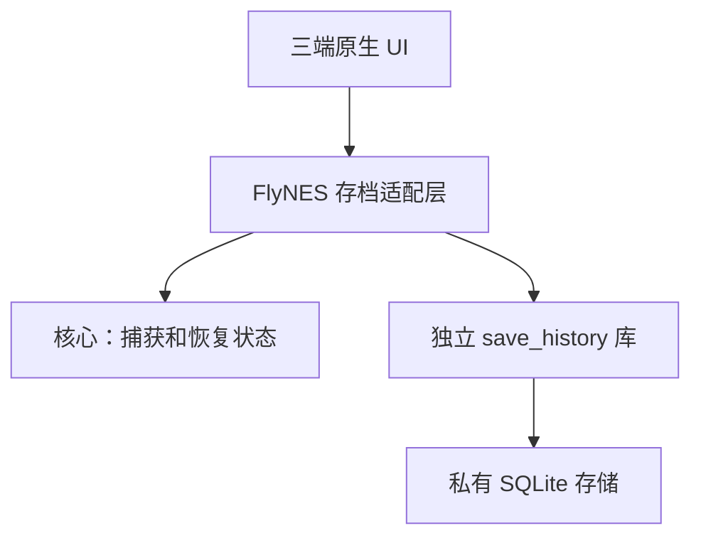

> 历史参考快照：早于main@3a2dc426存档交付。当前实现以仓库libs/save_history及docs/verification/2026-09-28-save-history-android-harmony.md为准；不要按本快照重复开发或推断验收状态。

# 独立存档库：现状与开源组件调研

日期：2026-09-28。用户要求优先检索现成开源组件，并让存档系统可独立作为库使用。结论来自本地代码和上游资料检查，未接入依赖、编译候选库或运行性能测试。本报告更新设计方向，不代表新存档系统已经实现。

## 1. 当前存档怎样工作

目前是每游戏一个自动快照，不是历史存档系统，也未用数据库管理存档：

| 平台 | 保存实现 | 保存时机和恢复 |
| --- | --- | --- |
| Android | `SaveRepository` 在 ROM SHA-1 目录写 `autosave.nst`、独立 `metadata.bin`；另有 `battery.sav` | Activity `onPause` 停止音频推进后保存；`onResume` 按设置读取。进入抽屉本身不是写档调用点 |
| iOS | 页面控制器在处理后的 canonical ID 目录写 `autosave.nst`，用 `NSDataWritingAtomic` 替换 | 加载 ROM 后恢复；暂停菜单、离开页面、失去前台等路径保存 |
| HarmonyOS | `CheckpointStore` 在 canonical ID 派生目录写临时文件，fsync 后 rename | `PlayService.open` 恢复；当前页面在打开暂停抽屉时保存。读档异常会隔离旧文件 |

代码入口：

- [Android SaveRepository](../../../app/src/main/java/com/flynes/emu/save/SaveRepository.java)、[MainActivity](../../../app/src/main/java/com/flynes/emu/MainActivity.java)。
- [iOS RunSurfaceViewController](../../../ios/app/run/RunSurfaceViewController.mm)。
- [Harmony CheckpointStore](../../../harmony/entry/src/main/ets/service/CheckpointStore.ets)、[PlayService](../../../harmony/entry/src/main/ets/service/PlayService.ets)、[RunGame](../../../harmony/entry/src/main/ets/pages/RunGame.ets)。

自动保存会替换上次进度；当前无定时历史、关卡历史、手动历史列表或回退入口。已有核心能力负责序列化完整模拟器状态；数据库不会替代它。原生电池存档也不等同于完整模拟器快照。

Android 的状态文件和时间文件各自原子写入，但不是一个共同事务；三端快照编码和游戏目录键也不统一。迁移时不能凭同名 `autosave.nst` 假定格式兼容。

## 2. 已检索的开源候选

| 候选 | 上游资料确认的定位 | 本项目判断 |
| --- | --- | --- |
| [SQLite](https://sqlite.org/whentouse.html) | 嵌入式 SQL 数据库，官方列有设备和应用文件格式场景 | 推荐作为持久化基础；仍须实现存档领域逻辑 |
| [SQLiteCpp](https://github.com/SRombauts/SQLiteCpp) | SQLite C++ 包装，MIT，当前主线使用 C++17、RAII 和异常，提供 CMake 接入 | 可选；优先直接使用 SQLite C API 并只封装资源释放和错误码，减少一个依赖。不是存档系统 |
| [LMDB](https://github.com/LMDB/lmdb/blob/mdb.master/libraries/liblmdb/intro.doc) | 提供事务的内存映射键值存储 | 能作为底层，但时间/类型/保护状态查询要设计自己的索引；本需求优先 SQLite |
| [RetroArch task_save.c](https://github.com/libretro/RetroArch/blob/master/tasks/task_save.c) | 有存读档、撤销恢复等逻辑；源码依赖 core、runloop、configuration、音视频和任务框架 | 借鉴行为；直接抽取会引入较多耦合，不作为独立库接入 |
| [Ludusavi](https://github.com/mtkennerly/ludusavi) | Rust 编写的 PC 游戏存档备份工具，提供 GUI/CLI | 适合备份已有文件；不能直接替代移动端进程内快照捕获与恢复组件 |
| [Save Game Free](https://github.com/BayatGames/SaveGameFree) | MIT 的 Unity 存读档组件，使用 Unity/C# 集成 | 技术栈不匹配，不引入 Unity 作为依赖 |
| [cereal](https://uscilab.github.io/cereal/) | C++ 序列化库，支持二进制、JSON、XML | 现有核心已经生成状态字节，不需要重新序列化；它不提供存档历史事务和保留策略 |

本次检索未找到可直接嵌入、独立于游戏引擎并满足 Android/HarmonyOS NEXT/iOS 存档历史需求的完整组件；这不是对所有开源项目的穷尽结论。上游桌面构建或“跨平台”描述不等于已通过鸿蒙 NEXT 验收。

## 3. 是否引入数据库

单槽自动存档不需要数据库。新增历史、截图、时间排序、保护标记、回退来源、当前继续位置、容量清理和格式迁移后，推荐 SQLite，理由是统一的事务与查询能力，而不是记录数量大。

SQLite 的事务能将同一数据库内的一组更改共同提交，避免“状态保存了，索引或当前继续位置没保存”的一部分故障。参见 [原子提交说明](https://sqlite.org/atomiccommit.html)。

| 方案 | 优点 | 成本/限制 | 建议 |
| --- | --- | --- | --- |
| 文件 + JSON 索引 | 直观，外部工具容易读取 | 要自己处理多文件提交、索引恢复、查询和并发 | 不作为新的历史系统默认实现 |
| SQLite：索引、状态 BLOB、缩略图全部入库 | 一笔事务管理完整记录和继续位置；没有外部文件孤儿 | 数据库增长、写入延迟、备份与空间回收要测量 | 推荐首版 |
| SQLite 索引 + 独立状态文件 | 大对象可单独操作 | SQL 事务不能覆盖外部文件，需要提交协议、孤儿回收和重建 | 测量证明确有收益后再引入 |

不预先认定 BLOB 全部入库更快。SQLite 官方的 [BLOB 内外置比较](https://sqlite.org/intern-v-extern-blob.html)本身就是特定硬件、文件系统和版本的结果，不能将其阈值直接套到手机。用本项目真实快照尺寸、截图和存档频率做三端对照。

推荐一个存档根目录一份数据库，单写者串行操作；首版优先 rollback journal + FULL 同步，是否使用 WAL 由读写并发与实测决定。WAL 会增加旁路文件和 checkpoint 管理，不能为“看起来更快”默认打开。资料：[WAL](https://sqlite.org/wal.html)、[同步级别](https://sqlite.org/pragma.html#pragma_synchronous)。数据库提交正确性仍依赖操作系统和存储设备兑现同步语义。

记录容量预算与数据库实际磁盘占用分别统计；删除记录后页可复用，但不承诺文件立即缩小。空间整理必须在空闲时受控执行，不能每次自动保存都全库压缩。

采用已核验版本的官方 [amalgamation](https://sqlite.org/amalgamation.html)并锁定校验值，三个平台共享源码版本与编译选项。SQLite 官方源码属于 [public domain](https://sqlite.org/copyright.html)。本轮未选定/下载发布版本；实施时核验版本、上游修复记录、三端编译和许可证清单。

## 4. 独立库的责任与依赖方向

建议放在 `libs/save_history/`，拥有独立 `CMakeLists.txt`、公开头文件、测试、示例和安装导出配置。库使用 C++17，提供 C ABI；SQLite 是实现细节。

### 库负责

- 不透明状态和可选缩略图的完整记录写入、读取、分页查询。
- ID、内容指纹、格式版本、时间/时长、备注和父记录关系。
- 保护记录、保留策略、容量预算、当前继续位置。
- 完整性校验、数据库 schema 升级、通用错误码。
- 将“恢复前保护点”和待恢复操作可靠提交；提供完成/取消操作的持久化接口。

### 外部适配层负责

- ROM/游戏目录标识映射，旧版三端存档文件解析与迁移。
- 前台实际游玩计时、暂停/退出通知、关卡识别和用户设置。
- 安全停帧、捕获同一时刻的核心状态与画面、实际加载目标状态。
- 截图编码、输入释放、音频清理、恢复失败后的核心重建和 UI 提示。

可以提供一个无线程、无系统时钟依赖的自动保存策略辅助模块，由调用方传入累计运行时间；库不能自行查询 Activity、UIKit、ArkUI 或创建另一个模拟器步进线程。

公开 API 不出现 `RomIdentity`、FlyNES 游戏目录类型、`nes_t`、`fly_runtime_t`、Android Context、UIKit/ArkUI 对象、SQLite 类型或 SQL 字符串。调用方提交二进制数据和通用元数据，读回后自行交给对应核心恢复；库不解析 NES 快照内容，也不靠回调反向操作游戏。

同一库句柄串行调用，后台执行器由适配层持有；不把数据库 I/O 放入实时音频回调。C ABI 明确缓冲区所有权、长度上限、错误码和版本；异常不穿过 ABI。一个真实后端足够，不先实现多数据库插件体系。

## 5. 数据模型与恢复一致性

最小表概念：

- `snapshots`：记录元数据、状态/缩略图 BLOB、校验值、类型与保护属性。
- `heads`：每个内容/格式域当前应继续的记录 ID。
- `restore_operations`：恢复目标、恢复前保护点、原 head、操作状态与幂等 ID。
- `schema_migrations`：版本和迁移记录。

父记录、head、待恢复目标和保护点受到引用约束，不能被普通自动清理删掉。成功创建新记录与淘汰符合条件的旧记录在同一事务内提交；失败不丢旧记录。

恢复过程分两段：

1. 外部先停帧并捕获当前状态；库在事务中保存恢复前保护点和恢复操作，保留原 head。
2. 外部加载目标状态；成功后调用完成接口原子更新 head。失败则外部恢复保护点，库取消操作并保留历史。

模拟器内存与 SQLite 无共同事务。完成提交失败时外部保持暂停，并通过幂等操作状态查询消除歧义，不能提示恢复成功后直接继续。进程在完成提交前退出，重启保留原 head 并提供保护点；完成提交后退出则从目标 head 恢复。库只承诺持久化状态，不虚假承诺可以回滚外部核心。

## 6. 如何证明它确实是独立库

1. 在不配置 FlyNES 根工程、核心、平台 SDK 的情况下，独立构建并运行所有库测试。
2. 安装后，用外部最小 C/C++ 程序经 `find_package` 消费；保存任意测试字节、关闭重开、列出、读取并比较，不包含任何 NES 代码。
3. 真实 SQLite 故障测试覆盖中断提交、空间不足、迁移失败、保护记录淘汰约束、恢复完成失败与重试；先证明失败断言再实现。
4. 从公开头文件、链接依赖和构建目标三方面检查无 FlyNES/平台反向依赖。
5. 再分别接入平台薄适配层，运行仓库要求的相关测试，并验收真实游戏回退和重开。

当前推荐为“独立存档历史库 + SQLite，核心快照生成/恢复由外部适配”。无需同步重构整个模拟器，也不需要远端数据库或服务进程。
