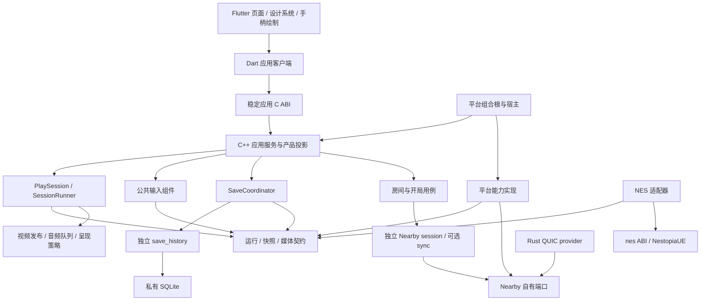

# FlyNES Flutter 三端统一架构与重构落地路线

日期：2026-09-28。当前代码审阅基线：`main@78057350c12b`，版本 `2.0.0`。

> 工作区进展：用户随后授权建立 `codex/flutter-foundation` worktree、迁移版本到 3.0.0 并搭最小骨架。本文的 2.0.0 是架构审阅起点，不是当前分支版本；实际进度见 [STATUS](STATUS.md)。正文“仅方案/未创建工程”描述的是最初方案交付时点，不覆盖后续已授权的基础工作；其余详细需求仍由用户逐块指派。

**决策状态：用户已确定采用 Flutter。** 本文是本次讨论的统一架构与需求清单入口，覆盖 Android、HarmonyOS NEXT、iOS。它取代此前材料中“框架未定”“Flutter 与游戏引擎竞争选型”的结论；此前源码分析与事实依据仍可参考。

**交付范围：仅架构、模块边界、迁移路线和需求列表。** 不包含详细需求设计、函数签名、数据库表结构、逐文件实施步骤或代码。本次未创建 Flutter 工程，未修改产品、依赖、版本及发布配置。选型确定不等于三端集成已验证，也不构成本任务立即开始实施的授权。

目标：以一份 Flutter 产品界面、一份 C++ 产品行为和明确的平台能力适配，降低三端功能追平、重复测试和 AI 自动开发的成本；附近联机、存档历史保持可独立消费，输入与输出分离。

技术基线：Flutter/Dart 呈现层；C++ 公共服务、输入、运行和媒体契约；现有 NestopiaUE/`nes_*`；现有 Rust QUIC provider；独立 C++17 `save_history` 与私有 SQLite。具体 Flutter/OH 发行、插件及依赖版本在前置验证中锁定，不在本文猜定版本组合。

## 1. 已确认的方向与边界

| 决策 | 本次确定的方向 |
| --- | --- |
| 三端 UX | 一份 Flutter 页面、主题、导航、文案及公共交互；平台目录最终只保留宿主、系统实现与集成测试 |
| 游戏界面 | 最终统一暂停菜单、触屏手柄、布局编辑、保存与房间入口；完整原生游戏页仅作为有退出条件的过渡 |
| 核心与媒体 | 复用现有 NES、滤镜及音视频成果；通过共享契约接 Flutter 容器，不将模拟/回滚/PCM 改写成 Dart |
| 附近联机 | 独立通用库，连接会话必选、确定性同步可选；优先服务 FlyNES，能接其他游戏；不依赖 ROM 目录和 UI |
| 手柄输入 | 触屏、键盘、实体手柄进入同一公共输入接口；公共行为组件与 Flutter 绘制分开 |
| 存档 | 接续关联任务的独立 `save_history`，统一公共保存/恢复/重开编排；不另做 Flutter 存档数据库 |
| 自动化 | 默认通过源码、脚本与机器可判定测试工作；日常回归尽量无需人工点击；真实硬件证据保留 |
| 平台适配厚度 | 平台只翻译系统事实、执行系统操作和管理设备资源；复杂设备实现允许存在，产品规则不能复制 |
| 渐进迁移 | 先固定契约，再按可验收功能切换；每条路径只有一个生产所有者；新路径通过后退役旧实现 |

本轮保持附近功能既定范围：三端均可建房/加入，LAN 优先，Android 无可用 LAN 时尝试公共 API 本地热点，其他不支持的情形显示就地设置指引；只有 QR 配对；本地同 ROM 自动准备、暂停/回房间/继续和同连接换游戏。

不扩展好友、蓝牙发现、配对码、ROM 传输、STREAM、联机自动恢复、云存档、通用关卡识别或新模拟核心。硬件手柄基础接入纳入本路线；具体设备清单在实施前形成验收矩阵，不承诺全部型号与震动能力。

## 2. 当前问题与重构目标

| 当前边界问题 | 要达到的结构 |
| --- | --- |
| Android 单机直接 `nes_*`，iOS/Harmony 单机 `fly_runtime_*`，联机走 `fly_lan_mvp_*` | 对产品统一 PlaySession，底层驱动可不同；保留旧格式兼容，不机械替换执行路径 |
| 当前 LAN 会话同时持有网络、ROM、runtime、输入历史、画面与 PCM | 连接、同步、游戏适配、运行和媒体各自归属清楚 |
| 三端页面重复维护导航、暂停、保存与连接规则 | Flutter 共享表达，C++ 应用服务拥有权威行为 |
| 输入仅按来源类别合并，方向手势/短按逻辑分散 | 设备实例、触点所有权、玩家座位和逐帧输入统一 |
| 底层头包含应用大头，平台引用共享 `src/` | 小型公共契约、明确 CMake target、公有/私有头隔离 |
| 历史会话模型与当前路径并存 | 按生产调用图迁移和退役，未用能力不成为新库依赖 |
| 新存档功能在独立任务推进 | 复用其库和证据，逐步收敛公共编排，不重复实现 |

上述是静态审阅结论，不是当前构建或实机认证。更完整依据见 [原架构梳理](architecture-analysis.md)。

## 3. 总体分层与依赖规则



箭头表示主要源码依赖，运行时实现由组合根注入。运行层通过端口调用 NES/平台实现，不反向包含其实现头；独立库的公开契约由各自库拥有，不依赖 FlyNES foundation。

约束：

1. 业务事实只在 C++ 应用/运行层及指定持久化库中拥有一份权威。Dart 可缓存不可变投影，不能另建游戏目录、存档 head 或联机状态机。
2. Flutter 依赖 Dart 客户端，客户端依赖公共 ABI。页面不能直接访问 SQL、`nes_*`、QUIC、平台私有桥或共享 `src/`。
3. 端口定义在消费者一侧或独立库公开契约中；实现通过组合根装配。禁止全局服务定位器和横跨所有模块的“万能公共类”。
4. 联机库、存档库各自可独立配置、构建、安装和被非 NES 程序消费；不强制拆仓库、不要求动态插件。
5. 同一产品实现一份，真实系统差异通过能力与原因表达；不能为了外观一致启用没有设备证据的模式。
6. 以 target 依赖和公开头验证分层；逻辑模块不等于一个动态库、一个线程或一个 Dart package。
7. 优先迁移职责，最后整理路径；不同时变更网络协议、存档格式、输入规则和媒体时钟。

## 4. 模块清单与职责

以下模块编号用于关联需求。模块可以由同一构建产物交付，但职责、状态所有者及依赖必须可区分。表中“对外边界”是契约类别，不是详细接口设计。

### 4.1 Flutter 呈现层

建议位于 `ui/flutter/lib/`；不额外引入 Flame 作为公共输入组件的强依赖。状态管理/路由包在前置验证中按 OH 兼容性、可测试性选择一套，不同时建设多套框架。

| 编号 / 模块 | 职责与拥有的状态 | 对外边界与依赖 | 不负责 |
| --- | --- | --- | --- |
| F01 AppShell / Navigation | 启动、页面路由、临时表单、弹层、订阅生命周期 | 只读权威状态与发命令；依赖 B01、F02 | 根据页面销毁断联/关库；推断游戏已启动 |
| F02 DesignSystem | 颜色、字体、间距、组件、横竖屏/安全区、无障碍、本地化 | 各页面共享 token/组件；集中视觉基线 | 系统能力判定、业务文案原因码生成 |
| F03 Library / Sources / Detail | 游戏列表、搜索收藏、详情、内容来源与导入进度 | 消费 A02/A04/A08 投影 | 解析 ROM、自行判定是否有存档、硬编码内置游戏 |
| F04 Settings / LayoutEditor | 设置、输入映射、玩家绑定与手柄布局编辑 | A03 设置、I01 几何/预览、I03 座位状态 | 另存权威配置、重复实现布局命中算法 |
| F05 NearbyPages | 邀请/扫码入口、连接过程、房间、选游戏与失败展示 | A05 命令/投影；扫码采集通过 P05 | socket、ROM 匹配规则、另一套房间状态机 |
| F06 SaveHistoryPages | 列表、预览、命名、保护、删除、恢复/重开确认 | A06 命令/投影与分页资源 | 直接访问 SQLite、按最新时间猜继续位置 |
| F07 PlaySurface / Overlay | 游戏画面容器、触屏绘制、暂停菜单及状态反馈 | 原生 texture/view 宿主；I01 视觉状态与指针事件 | 逐帧复制 PCM/像素到 Dart；模拟步进或输入锁存策略 |

### 4.2 绑定与基础契约

| 编号 / 模块 | 职责与拥有的状态 | 对外边界与依赖 | 不负责 |
| --- | --- | --- | --- |
| B01 DartAppClient | 类型明确的命令、状态订阅、取消、错误转换、资源释放 | 消费 B02；OS 操作走窄平台桥 | 把 FFI 包装成第二套业务服务；UI isolate 阻塞加载 ROM |
| B02 ApplicationABI | 不透明句柄、版本化 DTO、操作 ID、结果及事件交付 | 包装 A 层；区分控制命令、观察与小型输入事件 | 暴露 STL、SQLite、JNI/N-API 对象；任意工作线程调用 Dart 对象 |
| B03 Foundation / Ports | FlyNES 错误、缓冲所有权、代次、时间与资源端口等小型契约 | 供共享模块依赖；拆开基础类型与应用大头 | 让 Nearby/save_history 反向依赖 FlyNES；全局状态中心 |

### 4.3 公共应用与产品层

建议位于 `shared/application/` 与 `shared/product/`，命令编排与 UI 投影分离；复用现有 `fly_app`，不另起平行目录数据库。

| 编号 / 模块 | 职责与拥有的状态 | 对外边界与依赖 | 不负责 |
| --- | --- | --- | --- |
| A01 AppComposition / Lifecycle | 应用级服务所有权、创建销毁、标准化生命周期编排 | 装配应用服务、执行器及系统端口；由平台宿主启动 | 业务算法、与页面绑定的核心生命周期 |
| A02 Catalog / Import | 游戏身份、来源索引、扫描/去重、收藏/最近状态、内容查询 | 现有 catalog/app＋P04；发布导入进度 | 平台目录弹窗、嵌入各端 ROM 副本 |
| A03 Settings / ControlProfiles | 通用/游戏设置、控制布局和映射配置的权威持久化 | 现有 settings/layout；向 I/F 层提供版本化配置 | 键盘/手柄驱动、按平台重复规则 |
| A04 Launch / PlayUseCases | 开始/继续/重新开始、切游戏、暂停/退出的产品流程 | 协调 R01、A06、A08；联机操作交 A05 | 直接 step、UI 导航栈、自己维护存档 head |
| A05 NearbyUseCases | LAN/热点准备策略、邀请、内容匹配、准备/开局、换局/回房间 | N01/N02、R01、A02、P03/P05；连接与局分离 | NES 数据编码、平台网络 API、媒体队列 |
| A06 SaveCoordinator | 自动计时、保存触发、保护后恢复/重开、旧档迁移编排 | S01、R03 快照端口、A02/A03、P04 | 数据库内部、第二个模拟线程、联机单方回退 |
| A07 CoverService | 同帧封面捕获策略、评分/选择、缓存元数据与持久化意图 | R/M 媒体读取端口、P04 编码/文件能力 | 因重演反复落盘、把存档截图当成可随意换帧的封面 |
| A08 ProductProjection / Capabilities | 页面所需状态、能力开关、拒绝原因和命令结果 | 从应用/运行/设备事实组合只读投影 | 独立权威业务数据库；仅看设备型号就批准高刷模式 |

### 4.4 公共运行与游戏适配

| 编号 / 模块 | 职责与拥有的状态 | 对外边界与依赖 | 不负责 |
| --- | --- | --- | --- |
| R01 PlaySession / Drivers | 运行状态、局/时间线代次、单机与联机驱动选择 | LocalDriver / NearbySyncDriver 消费 R03；联机驱动在 FlyNES 集成侧 | 通用 Nearby 持有 FlyNES runtime；页面决定驱动细节 |
| R02 SessionRunner | 核心唯一串行执行权、命令队列、停帧边界、调度 | 执行 step/load/restore；消费输入，发布媒体 | 显示读取隐式步进；在实时音频回调里等待 I/O |
| R03 RuntimeContracts | 游戏能力、帧输入/输出、快照捕获恢复及缓冲生命周期 | NES 实现、运行层消费；适配 Nearby SimulationPort | 具体设备类、核心内部对象、数据库类型 |
| G01 NESAdapter | ROM 加载、NES 输入编码、状态格式/摘要、电池状态语义 | 实现 R03/同步端口；调用 G02 | 产品页面、配对、历史保留和存档查询 |
| G02 NESCore | CPU/PPU/APU/mapper、序列化与源帧时序 | 保留 `nes_*` 与 NestopiaUE | Flutter、网络、SQLite、平台 SDK |

### 4.5 公共输入组件

建议先在 `shared/input/` 形成可单独测试的组件 target；不依赖 Flutter、UI 平台对象、NES 或 Nearby。无实际外部消费者时，不为了“独立”增加新仓库。

| 编号 / 模块 | 职责与拥有的状态 | 对外边界与依赖 | 不负责 |
| --- | --- | --- | --- |
| I01 VirtualPadCore | 几何命中、触点归属、方向迟滞、滑动/组合、多指、取消 | PointerEvent → 逻辑按键与 ControlVisualState；复用现有 layout/hit map 纯算法 | 绘制、网络、系统触摸采集 |
| I02 InputHub / Mapping | 设备实例/代次、按键与轴归一化、死区、映射、来源持有合并 | P02/键盘/触屏事件 → 规范化玩家输入 | GUID 当连接 ID；松开一个来源清掉其他来源 |
| I03 SeatRouter / FrameSampler | 设备→本地玩家→游戏座位、短按保持、帧输入消费 | 生成与单机/联机共用的 FrameInput | UI 帧驱动采样；房主身份等同某个硬件设备 |
| I04 FeedbackRouter | 手机触感与手柄反馈分别路由、能力判断 | 应用反馈事件 → P02 输出 | 假设 NES 原生具有震动；不支持设备仍报成功 |

NES 按键位编码在 G01，不进入通用设备模型。暂停菜单命令与 NES Start 分开。远端帧输入进入同步历史，不重走本地触屏来源合并。SDL/GameControllerDB 可作为后端/映射资源候选，但不作为三端实体手柄开箱可用的假设；选定第三方组件前核对各端实际覆盖及许可。

### 4.6 公共媒体与呈现

| 编号 / 模块 | 职责与拥有的状态 | 对外边界与依赖 | 不负责 |
| --- | --- | --- | --- |
| M01 VideoPublisher | 帧身份、格式、缓冲所有权、只读发布、重演最终帧 | 原生 renderer/截图服务读取；有界缓冲 | 每次 Flutter 重绘推进核心；旧帧替换新局 |
| M02 AudioPipeline | PCM 队列、时间线、消费游标、回滚去重、重置 | P01 AudioSink 拉取；报告欠载/缓冲状态 | Dart 消息逐帧搬 PCM、网络回调直接播音 |
| M03 PresentationPolicy | 纯显示策略、源/显示节奏、滤镜配置和资格决策 | 消费设备事实，输出原生 presenter 请求 | Metal/EGL/OHAudio 对象；无证据开放高刷新/Extreme |

先统一数据契约与策略，保留三端已验证的渲染器/音频设备；GPU 算法公共化按实际纯逻辑边界推进，不强求把所有后端合成一套实现。Flutter texture 与 native view 容器通过三端验证择一或按能力适配，产品页面保持同一份。

### 4.7 独立联机与存档库

| 编号 / 模块 | 职责与拥有的状态 | 对外边界与依赖 | 不负责 |
| --- | --- | --- | --- |
| N01 NearbySession / Protocol | 邀请载荷与有效性、连接/成员身份、受控消息通道、协议版本与会话事件 | 自有契约；传输注入；应用负责 QR 图像呈现 | ROM、目录、玩家按钮格式、画面/PCM、热点系统调用 |
| N02 DeterministicSync | 帧输入历史、预测、确认、回滚窗口和确定性校验 | 可选模块；InputSchema＋SimulationPort | 任意游戏都可回滚的承诺；磁盘存档、图片和平台时钟 API |
| N03 QuicProvider | 复用 Rust QUIC、传输收发、取消、流控和网络绑定适配 | 实现 N01 自有传输端口；版本锁定 | 游戏规则、页面错误文案、运行核心 |
| S01 SaveHistory | 不透明状态/截图、查询、保护、保留/配额、校验、head、操作持久化 | 独立 C++17/C ABI；SQLite 私有依赖 | ROM 解析、捕获核心、自动调用 UI、联机同步 |

N01 可被仅需通用消息会话的其他游戏使用，N02 只适用于满足确定性契约的游戏。N01/N02/S01 不相互引入产品级依赖。存档历史、联机回滚状态和 NES 电池存档具有不同所有者与生命周期。

邀请与成员凭据沿用现有安全语义，抽库不削弱校验；协议载荷有类型、版本、大小和队列上限，远端输入只接受已授权座位，旧局数据隔离。原始邀请/连接材料不写普通诊断日志。这些属于通用协议边界，不放在 Flutter 页面校验中。

### 4.8 三端平台能力适配

每端实现同一组窄端口，组合根持有资源；跨语言桥只转换类型、线程和错误。Android Java/Kotlin/JNI、Harmony ArkTS/N-API、iOS Swift/ObjC++ 均不持有新的产品规则。

| 编号 / 模块 | 平台保留职责 | 公共层决定的内容 |
| --- | --- | --- |
| P01 MediaHost | texture/view、GPU surface、Metal/EGL、AudioTrack/OHAudio/AVAudio、设备中断与释放 | 使用哪个媒体源、暂停/恢复意图、滤镜/呈现资格 |
| P02 InputDevices | 系统按键/轴/热插拔、触点坐标转换、设备能力、触感/震动 | 映射、来源合并、短按、座位与反馈策略 |
| P03 NetworkAccess | 网络事实、接口/租约绑定、Android 本地热点 API、系统设置跳转 | LAN 优先、何时尝试热点、超时/取消与引导状态 |
| P04 StorageAccess | 沙箱路径、系统选文件、持久授权、安全读取、旧端格式读取与必要图像编码 | 内容身份、导入去重、历史策略、迁移与保存结果 |
| P05 CameraScanner | 相机权限/预览/扫码结果、取消及资源释放 | 邀请校验、是否接受旧扫描结果、连接与页面流程 |
| P06 HostLifecycle | Flutter 宿主、前后台/方向/安全区、系统可执行期限、签名与包身份接线 | 会话是否暂停/销毁、保存触发、路由和数据恢复 |

平台会保留真实差异，例如不同 GPU 后端或热点能力。这不构成三端行为分叉；共同语义、失败原因和可恢复路径由公共层定义。

### 4.9 工程基础设施

| 编号 / 模块 | 职责 | 边界 |
| --- | --- | --- |
| E01 ContentPipeline | 清单、ROM/许可单一来源及资源生成 | 保留 `content/`，Flutter 仅消费生成结果；不新增第三份资源来源 |
| E02 BuildPackaging | 三端 SDK/Flutter-OH/依赖锁定、CMake 导出、平台打包、SBOM/版本同步 | 遵守现有 VERSION/major/worktree/hook 规则；不重建版本体系 |
| E03 QualityAutomation | 公共测试、Dart 测试、视觉基线、三端安装/回归、依赖门禁和证据汇总 | 构建、模拟器、真实可玩与硬件指标分别报告 |
| E04 Diagnostics | 操作/会话/局关联日志、输入/媒体/保存时序与有界诊断 | 默认本地、脱敏；不记录 ROM 字节、凭据或把诊断变成业务依赖 |

## 5. 状态、线程和持久化归属

| 状态/资源 | 唯一所有者 | 其他层使用方式 |
| --- | --- | --- |
| 页面、搜索词、未提交表单、弹层 | Flutter 呈现层 | 用权威事件校正路由；不宣布尚未完成的业务成功 |
| 目录、收藏、设置、输入配置 | 现有公共 app/catalog/settings，经 A02/A03 管理 | Dart 状态与平台缓存只是投影；保留既有数据 |
| 网络连接 / 成员 | N01；生命周期由应用拥有者协调 | 房间页订阅；页面退出不必然断开 |
| 当前局、暂停、时间线与驱动 | R01/R02 | 输入、媒体、存档操作必须带对应代次 |
| 核心可变状态 | G01/G02，由 R02 串行访问 | 捕获/加载/恢复均通过唯一执行器 |
| 历史、head、保护点、恢复操作 | S01 数据库 | A06 编排与查询，不另存第二个 head |
| 网络租约、相机、音频/GPU 设备 | 相应 P 模块，由应用组合根持有 | 生命周期显式取得、失效、取消和释放 |

线程原则：Flutter UI isolate 只处理呈现和轻量事件；核心在唯一串行执行上下文；网络线程仅投递完成事件；存档/导入等工作队列承担阻塞 I/O；音频实时回调只读有界已发布样本。逻辑模块不各开一个线程，线程数量依据实际阻塞与实时需求设置。

所有跨边界操作携带操作 ID 和适用的会话/局/时间线代次；支持取消、超时与迟到结果丢弃。取消订阅不等于磁盘事务撤销；销毁需协调在途任务，禁止持锁等待线程退出或回调重入。

恢复/重开的公共顺序为：能力检查与停帧→保护当前状态→加载目标或创建新局→清理输入与旧媒体并切代次→可靠更新继续位置→报告成功并保持暂停。SQLite 与核心内存没有共同事务，提交歧义必须查询操作状态，不能先报成功再补写 head。

自动存档只按实际单机运行时间计时；暂停、后台、恢复操作及联机重演不计时。旧档迁移先复制验证、幂等发布，失败保留原件；同名文件不等于格式兼容，Android core state 与其他端 checkpoint 保留格式域。首版不允许联机一端自行加载用户历史。

## 6. 建议目录与现有代码归属

```text
ui/flutter/
  lib/app/                 # F01
  lib/design_system/       # F02
  lib/features/            # F03–F07：library/settings/nearby/saves/play
  lib/native_client/       # B01；需要外部消费时再拆 Dart package
  test/                    # 组件、纯 Dart 与受控视觉回归
  integration_test/        # 共享产品流程
libs/
  nearby/                  # N01/N02，独立构建、测试、示例和安装导出
  nearby/providers/quic/   # N03，迁移既有 provider，不重写协议
  save_history/            # S01，接续关联任务
shared/
  foundation/              # B03
  bindings/                # B02
  application/             # A01–A07；含 save/、nearby/ 等用例
  product/                 # A08 投影、纯产品模型
  runtime/                 # R01–R03
  input/                   # I01–I04
  media/                   # M01–M03
  game/nes/                # G01
core/                      # G02
app/、harmony/、ios/        # P01–P06、Flutter 宿主与各端集成测试
content/                   # E01 现有单一内容来源
tools/                     # E01/E02/E03；复用现有构建/质量脚本
```

这是目标职责地图，不要求首轮一次移动全部目录。Flutter 默认生成的宿主目录与现有平台工程只保留一份生产配置权威，前置验证时明确装配方式，禁止两套 bundle ID、签名、资源与版本配置长期并存。

| 现有区域 | 处理方向 |
| --- | --- |
| `fly_app`、catalog、settings、layout、product | 原位复用并逐步分 target；不重建业务数据 |
| `lan_mvp/session.cpp` | 连接/同步迁 N01/N02；ROM 迁 G01/A05；帧/PCM 迁 M；调度迁 R |
| `fly_runtime` / Android 单机 JNI | 保留兼容入口，逐端切 R/G；先证明媒体和存档兼容再退役旧路径 |
| Android DirectionSession/InputRouter、iOS FrameInputLatch/DirectionSession、Harmony GamepadOverlay | 行为迁 I，采集留 P，绘制迁 F07；保留原有行为测试 |
| 三端 SaveHistory Adapter/Service | 以关联任务最终产物为准；通用规则迁 A06，安全核心接线迁 R03，平台旧档接入留 P04 |
| 现有 GPU/音频/显示实现 | 纯策略迁 M03，设备后端留 P01，资源仅通过端口暴露 |
| 原生页面与语言桥 | 页面逐批迁 F；桥收缩为 B/P；按验收范围移除旧业务分支 |
| 历史 session v1/v2、旧配对/好友模型 | 先核对生产引用；当前路径替代后清理，不恢复废弃产品能力 |

## 7. 执行路线与阶段门槛

Flutter 已选定，G1 是迁移可行性放行门槛，不是重新进行无边界框架竞赛。若有阻塞，记录缺失能力、解决成本和范围影响，再由用户决定调整；不能静默换框架或永久把鸿蒙留为另一套完整 UI。

| 阶段 | 目标与范围 | 进入条件 | 阶段完成标准 |
| --- | --- | --- | --- |
| G0 基线与对齐 | 固定生产链路、用户数据/格式、工具链、既存问题与关联存档成果 | 本文作为需求范围依据 | 清楚哪些是既有能力、在制功能和未验收项；兼容清单与原版测量口径建立 |
| G1 Flutter 三端闭环 | 优先鸿蒙自动构建/安装/测试，补齐 Android/iOS；真实目录→原生游戏→返回 | G0 | 一份 Dart 页面、真实 C++ 状态、可重复命令链、生命周期与数据保留通过；不得仅验 Hello World |
| G2 基础边界与外围 UX | B/A 基础服务、设计系统；游戏库/详情/来源/设置先迁 | G1；相应旧行为基线 | 三端共享外围 UI，仍可打开原生游戏页；该范围旧页面有退役清单 |
| G3 公共输入与存档 | I 模块；复用 S01；统一 A06、格式兼容与保存 UX | G0 契约可先行；Flutter 页面接入依赖 G2 | 三端触屏规则与存档语义一致，基础物理手柄接线可验；iOS 存档补齐不能省略 |
| G4 联机库与统一运行 | N01/N02/N03 独立化，R/G/M 单一执行与输出；迁移房间 UI | 基础契约完成；已交付输入/存档保持兼容 | 独立非 NES 消费者＋真实跨端联机可玩；逐端替换旧入口 |
| G5 游戏内 UX 统一 | Flutter PlaySurface、暂停、手柄、布局编辑与反馈；原生媒体保留 | G3；对应 R/M 契约与三端容器验证 | 三端游戏内产品界面一份，媒体/输入/存档/联机没有回归，完整原生游戏页可退役 |
| G6 收口与交付 | 清理兼容/历史代码，架构门禁、自动化流水线、完整三端证据 | 各功能纵向验收完成 | 无永久四套 UI；版本/许可/数据兼容可追溯，未测硬件项单列 |

阶段并非全串行：G0 后可以推进独立库、纯输入和存档契约；G2 页面迁移不必等待全部联机抽取。但同一会话执行权、存档格式和平台桥接的改动按依赖顺序落地，不并发改写同一状态机。每个需求对应一个可独立审查的工作包，具体实施时再拆详细设计与 TDD 步骤。

## 8. 可执行需求列表

所有条目初始状态为“待接续/待实施/待验收”，表格不是完成声明。每项列出边界和可观察验收结果；依赖为直接前置，不重复列传递依赖。`REQ-` 编号保持稳定，后续任务和证据引用该编号。

### 8.1 基线与 Flutter 前置验证

| ID | 需求 / 阶段 | 模块 | 直接依赖 | 验收结果 |
| --- | --- | --- | --- | --- |
| REQ-001 | 固定生产调用图与兼容基线 / G0 | A01、R01、G01、E04 | 无 | 单机/联机入口、线程、媒体、存档格式、支持系统和已知问题均可追踪 |
| REQ-002 | 接续存档任务成果与剩余范围 / G0 | S01、A06 | 无 | 记录实际 revision、ABI/schema、Android/鸿蒙证据和 iOS 缺项；不重复开发已交付库 |
| REQ-003 | 建立相同设备/构建模式的测量基线 / G0 | E03、E04、M | REQ-001 | 冷启动、内存、包体、输入/音频/帧节奏有可比较口径；没有数据的指标明确标注 |
| REQ-004 | 锁定 Flutter 与 OH 工具链及宿主装配 / G1 | E02、P06 | REQ-001 | 固定可重复版本/插件组合；三端包身份、签名接线、资源与版本配置保持唯一权威 |
| REQ-005 | 先跑通鸿蒙自动构建安装和页面测试 / G1 | B01、B02、P06、E03 | REQ-004 | 命令驱动真实共享页面与 C++ 查询，输出明确退出码/报告；不靠人工点编辑器 |
| REQ-006 | Android/iOS 同源码与原生游戏往返 / G1 | F01、B、P01、P06 | REQ-005 | 三端真实目录→原生游戏→返回及后台恢复正确；iOS 有可用 Mac 执行证据 |
| REQ-007 | 数据保留与游戏容器可行性 / G1 | P01、P04、P06、M | REQ-006、REQ-003 | 覆盖安装保留用户数据/授权；texture/view 方案具有真实视频、触控、音频证据；为 G5 确认可行接法 |

### 8.2 公共基础与应用服务

| ID | 需求 / 阶段 | 模块 | 直接依赖 | 验收结果 |
| --- | --- | --- | --- | --- |
| REQ-008 | 拆基础契约与模块构建边界 / G2 | B03、E02 | REQ-001 | 底层不包含应用大头；target/public include 可检查；平台不依赖共享私有头 |
| REQ-009 | 建立稳定应用 ABI 与 Dart 客户端 / G2 | B01、B02 | REQ-008、REQ-006 | 类型、所有权、异步结果、错误与取消一致；旧绑定兼容；UI 线程不阻塞 I/O |
| REQ-010 | 应用级所有权与生命周期统一 / G2 | A01、P06 | REQ-009 | 页面/Flutter engine 重建不重复建核心或误断联；旧回调不能影响新局 |
| REQ-011 | 内容目录、导入与设置服务收敛 / G2 | A02、A03、P04、E01 | REQ-010 | 三端同数据同规则，来源授权保留，内容清单唯一，不新增产品硬编码游戏 |
| REQ-012 | 公共启动/暂停用例与能力投影 / G2 | A04、A08 | REQ-010、REQ-011 | 页面发意图，服务给权威状态和拒绝原因；单机/联机能力明确，未完成操作不报成功 |

### 8.3 公共输入与实体手柄

| ID | 需求 / 阶段 | 模块 | 直接依赖 | 验收结果 |
| --- | --- | --- | --- | --- |
| REQ-013 | 抽取触屏手柄行为与视觉状态 / G3 | I01 | REQ-008 | 多指、方向迟滞、滑入滑出/取消共用状态机；复用现有布局/命中；原生与 Flutter 可消费 |
| REQ-014 | 设备实例、映射与来源合并 / G3 | I02 | REQ-008 | 按键/轴规范化；两只同类设备区分；松开/拔出只清理相关来源；迟到事件隔离 |
| REQ-015 | 玩家座位与逐帧采样统一 / G3 | I03、G01 | REQ-013、REQ-014 | 触屏/键盘/手柄生成同一输入；短按真实采样后消费；NES 编码独立；应用命令分离 |
| REQ-016 | 三端物理输入与反馈接线 / G3 | P02、I04 | REQ-015 | 明确设备矩阵上的按键/轴/插拔/重连通过；手机触感与手柄反馈分别报告能力与失败 |

### 8.4 存档库及公共编排

| ID | 需求 / 阶段 | 模块 | 直接依赖 | 验收结果 |
| --- | --- | --- | --- | --- |
| REQ-017 | 接入独立存档库并补齐独立验收 / G3 | S01、E02 | REQ-002 | 不配置 FlyNES/NES 可构建安装，外部消费者保存/读取任意字节；沿用已测事务/保留行为 |
| REQ-018 | 自动保存与迁移编排公共化 / G3 | A06、A03、P04 | REQ-017、REQ-012 | 同一运行计时/去重/设置策略；旧档迁移幂等且失败不删；三端格式域清楚 |
| REQ-019 | 保护恢复、重开与继续位置统一 / G3 | A06、A04、R03 | REQ-018、REQ-015 | 先保护再切换；失败/提交歧义不报成功；重开后再次启动不回旧结局；旧历史可访问 |
| REQ-020 | iOS 存档补齐及三端兼容验收 / G3 | A06、P04、G01 | REQ-019 | 复用关联任务已有两端成果，补 iOS 实际恢复/重开与旧档；不能把两端通过记作三端完成 |

### 8.5 独立附近联机

| ID | 需求 / 阶段 | 模块 | 直接依赖 | 验收结果 |
| --- | --- | --- | --- | --- |
| REQ-021 | 抽取通用连接会话与协议 / G4 | N01 | REQ-008 | 不依赖 FlyNES/ROM/NES/媒体；仅消息消费者可运行；旧 wire/邀请校验保持，载荷与队列有界 |
| REQ-022 | 隔离默认 QUIC 与网络端口 / G4 | N03、P03 | REQ-021 | 既有 Rust provider 可替换装配；取消/关闭/网络失效可测；无产品状态机 |
| REQ-023 | 可选确定性同步与游戏端口 / G4 | N02、G01 | REQ-021 | 非 NES 确定性示例可步进/回滚；同步头无 FlyNES 类型；当前预测/确认行为不变；拒绝未授权座位与旧局输入 |
| REQ-024 | 统一房间/内容匹配与网络准备用例 / G4 | A05、P03、P05 | REQ-022、REQ-012 | 三端建房/加入、LAN 优先/热点引导、QR 单路径、取消、换游戏与回房间同语义 |

### 8.6 统一运行与媒体

| ID | 需求 / 阶段 | 模块 | 直接依赖 | 验收结果 |
| --- | --- | --- | --- | --- |
| REQ-025 | 统一运行/快照契约与 NES 适配 / G4 | R03、G01、G02 | REQ-008、REQ-019 | 保留旧状态格式/电池语义与源时序；捕获恢复只能经执行端口；核心保持平台无关 |
| REQ-026 | 建立唯一执行器与单机/联机驱动 / G4 | R01、R02 | REQ-025、REQ-015、REQ-023 | 每局一个 step/load/restore 所有者；逐端替换旧入口；读状态/媒体不推进模拟 |
| REQ-027 | 统一视频与音频发布 / G4 | M01、M02、P01 | REQ-026 | 回滚只发布最终画面、音频不重复；队列有界；恢复后旧媒体无残留 |
| REQ-028 | 呈现/封面策略与设备能力解耦 / G4 | M03、A07、A08 | REQ-027 | 三端共用纯策略，后端原生；截图与状态时刻对应；不因迁移开启无证据设备模式 |
| REQ-029 | 公共运行层接续存档及联机边界 / G4 | A06、R、N02 | REQ-026、REQ-020 | 只替换执行接线即可读现有历史；联机重演不写用户存档、不累计自动保存时间 |

### 8.7 Flutter 产品页面迁移

| ID | 需求 / 阶段 | 模块 | 直接依赖 | 验收结果 |
| --- | --- | --- | --- | --- |
| REQ-030 | 建立共享设计系统与路由 / G2 | F01、F02 | REQ-009、REQ-010 | 一份主题/文案/组件；横竖屏、安全区、文字缩放、焦点与基础无障碍具备自动用例 |
| REQ-031 | 游戏库、来源与详情迁移 / G2 | F03 | REQ-030、REQ-011、REQ-012 | 三端同页面代码完成导入/搜索/收藏/启动；继续按钮使用公共可恢复状态 |
| REQ-032 | 设置、布局编辑与输入绑定迁移 / G3 | F04 | REQ-030、REQ-011、REQ-015 | 配置只写公共服务，重启保留；预览与实际命中一致；设备绑定页面复用统一座位模型 |
| REQ-033 | 存档历史与恢复/重开交互迁移 / G3 | F06 | REQ-030、REQ-020 | 列表/截图/保护/删除/恢复与重开三端一致；只在公共操作成功后显示成功 |
| REQ-034 | 邀请、扫码连接与房间迁移 / G4 | F05 | REQ-030、REQ-024、REQ-026 | 三端一份页面，系统扫码薄适配；取消/迟到回调、准备、暂停/继续及同连接换游戏正确 |
| REQ-035 | Flutter 游戏容器与原生媒体接入 / G5 | F07、P01 | REQ-007、REQ-027 | 真实连续视频/音频、方向切换与后台恢复通过；Dart 不逐帧搬运像素/PCM |
| REQ-036 | 游戏内手柄、暂停与反馈统一 / G5 | F07、I、P02 | REQ-035、REQ-016、REQ-032、REQ-033、REQ-034 | 多指组合、短按、物理输入、菜单/保存/回房间同语义；三端原生业务覆盖层可退役 |

### 8.8 工程、自动化与收口

| ID | 需求 / 阶段 | 模块 | 直接依赖 | 验收结果 |
| --- | --- | --- | --- | --- |
| REQ-037 | 三端构建与资源/许可/版本集成 / G2–G6 | E01、E02、P06 | REQ-004、REQ-008 | Flutter 与原生库可重复打包；保留内容门禁、许可清单及 VERSION 单一来源；无多套生产宿主配置 |
| REQ-038 | 依赖、公开 ABI 与独立库门禁 / G2–G6 | E02、E03、B03 | REQ-008 | 禁止反向依赖/私有头；随 N/S 落地补独立消费者与 ABI 兼容检查 |
| REQ-039 | Dart 组件与受控视觉回归 / G2–G6 | E03、F02 | REQ-030 | 自动发现布局/文案/交互回归；固定字体/尺寸环境；视觉基线不能被自动无条件接受 |
| REQ-040 | 三端命令行安装与产品流程自动化 / G1–G6 | E03、P06 | REQ-005、REQ-006 | 日常运行不需手点 IDE；逐步覆盖已交付页面/存档/联机，输出可靠断言、日志和截图 |
| REQ-041 | 跨模块诊断与性能对照 / G2–G6 | E04、R、M、A06 | REQ-003、REQ-009 | 操作/会话/局可关联；比较输入到采样/显示、保存停帧与音频欠载；无私密数据泄漏 |
| REQ-042 | 三端真实游戏与联机验收 / G6 | E03、A05、R、F07 | REQ-036、REQ-029、REQ-040 | 两款真实 App 连接、同 ROM、双方输入和持续游戏；三端主客方向及 LAN/热点按矩阵记录，未测项不冒充通过 |
| REQ-043 | 覆盖升级与历史用户数据验收 / G6 | E03、A02、A03、A06、P04 | REQ-031、REQ-032、REQ-033、REQ-037 | 目录/收藏/设置/布局/旧档/新历史/授权保留；失败不以清数据规避 |
| REQ-044 | 退役重复 UI、旧门面及历史生产依赖 / G6 | F、B、A、R、N | REQ-042、REQ-043、REQ-038、REQ-039、REQ-041 | 无永久三套原生页面加 Flutter；删除有替代证据；旧数据读取兼容仍按承诺保留 |
| REQ-045 | 交付文档与需求证据闭环 / G6 | E02、E03 | REQ-044 | 每项需求关联实现版本/测试/限制；开发入口和架构图与最终实现一致，未完成项明确列出 |

## 9. 验证与自动化交付原则

实施继续遵守仓库 TDD 要求：行为变更先展示失败断言，再实现与相关回归；纯搬迁复用特征测试，不以检查文件名的测试冒充行为保证。

| 验证层 | 证明什么 | 不能替代什么 |
| --- | --- | --- |
| 公共 C++ / 独立消费者 | 输入、同步、存档事务、状态机和模块边界 | 三端系统接线、真实可玩 |
| Dart 单元/组件/golden | 页面交互、状态投影、布局与受控视觉差异 | 原生相机/授权弹窗、物理输入、实际音视频 |
| 平台集成与模拟器 | 安装启动、真实核心流程、存档迁移、取消/后台与 UI 接线 | 真机刷新率、端到端延迟、温控与功耗 |
| 真实设备与联机 | 同 ROM、双方输入、媒体/手柄及受影响系统能力 | 未在矩阵内的设备或全部网络环境 |

Android native/shared 变更运行 host＋Android unit，UI 变更加 instrumentation；Harmony 运行 host CTest＋Hypium，连接兼容设备时按仓库要求签名安装；iOS 使用 Mac 运行相关 runtime/UI 套件。保留原生平台测试接续系统交互，不假定上游 Flutter integration_test 自动支持所有 OH 插件和系统 UI。

自动化流水线目标：依赖/格式检查→受影响公共测试→Dart 组件/视觉检查→三端构建安装→产品流程断言→证据汇总。按改动影响选择检查，不为文档或无关模块启动全平台穷举。设备发现、安装、截图和结果采集尽量脚本化；设备信任/签名授权等首次准备及需要硬件判断的项目独立列出。

自动测试不得清理用户现有存档、导入私有 ROM 或把凭据输出到日志；使用隔离数据与明确许可内容。视觉基线通过设计评审后锁定，AI 不能通过批量接受截图变化让测试变绿。

## 10. 关联存档工作、切换与交付管理

关联任务 [修复通关后重新开始](codex://threads/01a0e85e-d42a-7360-b2d4-06e07971f3e5) 正在 `codex/save-history` / `.worktrees/save-history` 实施，最新范围先 Android/鸿蒙，iOS 后续。本次观察到任务仍活跃，不将其实现或测试记为已完成。本路线不修改该任务产物、不另开竞争实现；REQ-002 在接续时记录真正可复用的 revision 与缺项。

依次接续：独立 S01 库与测试→公共 A06 编排→R03 安全快照接线→Flutter F06 页面。关联任务已经完成的工作只计一次；平台 Adapter 中的纯业务规则在整体迁移中下沉，设备/旧档接线保留。

每个迁移范围先固定旧行为，再提供单一路径选择；同一会话不能双跑两个核心、同时写两套 head 或由两套 UI 同时发控制命令。按功能切换后停止旧页面新增功能；回退使用保留的数据兼容能力与旧装配，不通过删除新数据回退。删除旧代码晚于替代路径验收。

后续实施工作遵守现有仓库分支/worktree 分配和版本政策；本文不新建分支、不提升主版本。其他工作区的未提交数据、验证材料和存档保持不动。

不沿用此前“Flutter 外围 40–60 人日”作为本项目总预算：本路线还含独立联机、输入/运行统一、存档编排与 iOS 补齐、游戏内 UX 和自动化收口。完成 G0/G1 后按本清单逐项估算，扣除存档等已交付成果，区分前置验证、迁移和持续维护成本。

最终交付以 REQ-001～045 的证据为准：一份 Flutter 产品界面；一份公共产品/输入/存档编排；独立 Nearby/save_history；明确的核心/媒体/系统边界；三端可重复构建与实际功能验收。存在未完成的真机或平台项时，报告相应限制，不能把“合并、编译或模拟器通过”写成全部完成。

## 11. 参考与后续文档规则

- [此前架构梳理及存档合并边界](architecture-analysis.md)：源码证据与背景。
- [跨端技术与输入组件调研](technology-research.md)：候选比较与自动化资料；框架最终决策以本文为准。
- [存档产品方案](references/save-history-proposal.md)、[独立存档库调研](references/save-library-research.md)：保留/保护/恢复规则与库设计来源，实施成果另按 REQ-002 核实。
- [附近联机当前入口](../nearby/README.md)：现行产品范围与真实证据入口。
- [开发指南](../DEVELOPMENT.md)：工具链、平台检查、内容与版本约束。
- 关联任务 [评估 Flutter UX 迁移](codex://threads/01a0e860-0aee-7eb2-973d-16ef06ef6c3c)：早期迁移范围与估算背景。

后续按单个需求或一组直接相关需求补详细设计与实施计划，引用 REQ 编号；本总方案不堆入函数签名、SQL、逐文件 patch 或完整测试代码。范围、模块边界、需求依赖发生变化时更新本文；阶段实现证据写入独立 verification 记录。
